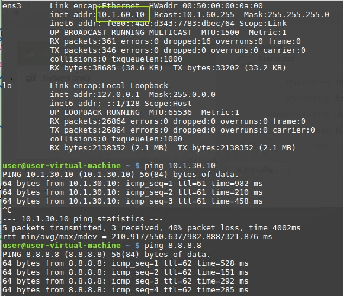

# Организация EVPN/VXLAN-фабрики для масштабирования существующей сети ЦОД

## Цель:

**Масштабировать существующую сеть ЦОД.**


## Решение:

**Топология:**


**Адреса p2p каналов:**


|  Узел сети уровня Spine | порт| Адрес Spine    | Узел сети уровня Leaf | порт | Адрес Leaf     | Сеть           |
|---------|---|-------------|-----------|---------|---|----------------|
| Spine1 | Eth1   | 10.10.1.0  | Leaf1-1 |Eth1    | 10.10.1.1 | 10.10.1.0/31  |
| Spine1 | Eth2   | 10.10.1.2  | Leaf1-2 |Eth1    | 10.10.1.3 | 10.10.1.2/31  |
| Spine1 | Eth3   | 10.10.1.4  | Leaf2-1 |Eth1    | 10.10.1.5 | 10.10.1.4/31  |
| Spine1 | Eth4   | 10.10.1.6  | Leaf2-2 |Eth1    | 10.10.1.7 | 10.10.1.6/31  |
| Spine2 | Eth1   | 10.10.1.8  | Leaf1-1 |Eth2    | 10.10.1.9 | 10.10.1.8/31  |
| Spine2 | Eth2   | 10.10.1.10  | Leaf1-2 |Eth2    | 10.10.1.11 | 10.10.1.10/31  |
| Spine2 | Eth3   | 10.10.1.12  | Leaf2-1 |Eth2    | 10.10.1.13| 10.10.1.12/31   |
| Spine2 | Eth4   | 10.10.1.14  | Leaf2-2 |Eth2    | 10.10.1.15| 10.10.1.14/31   |

**Адреса Loopback'ов:**

| Свитч  | Адрес Lo0  | Адрес lo1 | Адрес lo100 | Адрес lo100 sec |
|--------|------------|-----------|-------------|-----------------|
| Spine1 | 192.168.10.1 | 192.168.10.2 |  
| Spine2 | 192.168.10.3 | 192.168.10.4 |  
| Leaf1-1  | 192.168.10.5 | 192.168.10.6 | 192.168.10.7 | 192.168.10.111 | 
| Leaf1-2  | 192.168.10.8 | 192.168.10.9  | 192.168.10.10 | 192.168.10.111 |
| Leaf2-1  | 192.168.10.11 | 192.168.10.12 | 192.168.10.13 | 192.168.10.112 |
| Leaf2-2  | 192.168.10.14 | 192.168.10.15 | 192.168.10.16 | 192.168.10.112 |
|   FW   | 8.8.8.8

### В качестве технологии реализации было выбрано построение сетевой инфраструктуры ЦОД с организацией L3-фабрики с использованием технологии инкапсуляции VxLAN для обеспечения логического разделения клиентского data-трафика в overlay.
### Для сигнализации control plane используется протокол BGP с расширением EVPN.


### 1. Настрояка OSPF для Underlay

*Включаем маршрутизацию и процесс OSPF*

ip routing

router ospf 1

*Задаем router-id по ip адресу интерфейса Lo0*

router-id 192.168.10.X

*Добавляем peer-линки и лупбеки в area 0*

*Во избежание неточностей при настройке wildcard на всех интерфейсах протокола ospf устанавливается в 0.0.0.0. Таким образом протокол активируется только на интерфейсе с указанным адресом.*

 network 10.10.1.X/32 area 0.0.0.0

 network 10.10.1.Y/32 area 0.0.0.0

 network ip_lo0/32 area 0.0.0.0

 network ip_lo1/32 area 0.0.0.0

*на leaf'ах + lo100* 

 network ip_lo100/32 area 0.0.0.0

 network ip_lo100_sec/32 area 0.0.0.0

 **Проверяем, что видим соседей**

 

 **и маршруты**


 

### 2. Настройка iBGP для Overlay

*Включаем процесс BGP*

router bgp 65000

*Задаем router-id по ip адресу интерфейса Lo1*

router-id 192.168.10.X

*Разрешаем до 16 маршрутов для каждой подсети*

maximum-paths 16

*прописываем соседей, создаем peer группы spine\leaf, указываем что свитчи должны быть в AS 65000*

neighbor leaf peer group

neighbor leaf remote-as 65000

neighbor 192.168.10.X peer group leaf

neighbor 192.168.10.Y peer group leaf

neighbor 192.168.10.XX peer group leaf

neighbor 192.168.10.YY peer group leaf

*используем ip адрес loopback1 в качестве next-hop для iBGP*

neighbor leaf update-source Loopback1

*Включаем send-community (включает и standard, и extended) для рассылки route target*

neighbor leaf send-community

*так как используем iBGP настраиваем Spine'ы в качестве route reflector*

neighbor leaf route-reflector-client

**Проверяем, что соседство установилось**


### 3. Настройка MLAG

*Для обеспечения отказоустойчивости и балансировки трафика на уровне leaf применяется технология MLAG*

interface eth3-4

*включаем LACP*

channel-group 10 mode active

*Добавляем интерфейсы в port channel 10*

interface port-channel 10

switchport mode trunk

*создаем VLAN с неиспользуемым идентификатором vlan для связи между узлами MLAG*

vlan 4094

*добавляем vlan 4094 и port-channel 10 в группу mlagpeer, т.о. vlan 4094 может передаваться только по port-channel 10*

trunk group mlagpeer

interface port-channel 10

switchport trunk group mlagpeer

*Это позволяет безопасно отключить Spanning-Tree*

no spanning-tree vlan 4094

*настроим ip адрес на vlan 4094*

*leaf1-1*

int vlan 4094

ip address 10.0.0.1/30

*leaf1-2*

int vlan 4094

ip address 10.0.0.2/30

*настроим mlag*

*leaf1-1*

```
mlag configuration
   domain-id mlag1
   local-interface Vlan4094
   peer-address 10.0.0.2
   peer-link Port-Channel10
```
*leaf1-2*

```
mlag configuration
   domain-id mlag1
   local-interface Vlan4094
   peer-address 10.0.0.1
   peer-link Port-Channel10
```
**Проверим**


*настроим port-channel с SW1*

*на leaf1-1 и leaf1-2*

interface Port-Channel30

switchport mode trunk

mlag 1

interface Ethernet6

channel-group 30 mode active

*на SW1*

interface Port-Channel30

switchport mode trunk

interface Ethernet1-2

channel-group 30 mode active

switchport mode trunk

### 4. Настройка VXLAN EVPN

*На Spine'ах и на Leaf'ах*

*Создаем address-family EVPN*

address-family evpn

*Активируем peer-группу spine\leaf в address-family EVPN*

neighbor leaf activate

*На Leaf'ах создаем vlan'ы*

vlan 10,20,30,40,50,60,70

*Часть vlan`ов (50 и 60) будет использовать distributed gateway внутри фабрики, остальные будут маршрутизироваться через Firewall для фильтрации трафика*

*для вланов 50, 60 и 70*

*создаем отдельный vrf*

vrf instance DS

*включаем для него маршрутизацию*

ip routing vrf DS

*создаем интерфейсы vlan и задаем виртуальный ip адрес для distributed gateway, общий для всех свитчей*

```
interface Vlan50
   vrf DS
   ip address virtual 10.1.50.1/24
!
interface Vlan60
   vrf DS
   ip address virtual 10.1.60.1/24
!
interface Vlan70
   vrf DS
   ip address 10.100.70.2/24

```

*Для всех vlan'ов создаем виртуальный mac-адрес, так же одинаковый для всех VTEP'ов*

ip virtual-router mac-address 00:00:22:22:33:33

*Создаем vrf'ы для наших vlan'ов*

router bgp 65000

vlan 20

*Указываем route destinguisher (loopback:vni)*

rd 192.168.10.6:10020

*и route target*

route-target both 1:10020

*Распределяем в этот VRF выученные ip адреса*

redistribute learned

```
   vlan 10
      rd 192.168.10.6:10010
      route-target both 1:10010
      redistribute learned
   !
   vlan 20
      rd 192.168.10.6:10020
      route-target both 1:10020
      redistribute learned
   !
   vlan 30
      rd 192.168.10.6:10030
      route-target both 1:10030
      redistribute learned
   !
   vlan 40
      rd 192.168.10.6:10040
      route-target both 1:10040
      redistribute learned
   !
   vlan 50
      rd 192.168.10.6:10050
      route-target both 1:10050
      redistribute learned
   !
   vlan 60
      rd 192.168.10.6:10060
      route-target both 1:10060
      redistribute learned
   !
   vlan 70
      rd 192.168.10.6:10070
      route-target both 1:10070
      redistribute learned
```

*Создаем туннельный интерефйс Vxlan1*

interface Vxlan1

*В качестве source interface указываем Lo100*

vxlan source-interface Loopback100

*Привязываем vlan к соответствующим vni*

vxlan vlan 10,20,30,40,50,60,70 vni 10010,10020,10030,10040,10050,10060,10070

*задаем vni для vrf DS*

vxlan vrf DS vni 10001

**Проверяем, что установилось соседство в EVPN**


**Проверяем, что клиенты внутри фабрики (Client2 и Client3) видят друг друга**


### 5. Настроим маршрутизацию через Firewall

*на boarder leaf'ах (leaf1-1, leaf1-2) добавим статический маршрут, чтобы трафик, не предназначенный для vrf DS (vlan 50, 60 и 70), уходил на Firewall* 

ip route vrf DS 0.0.0.0/0 10.100.70.1

*настроим обмен маршрутами внутри vrf DS*

*на всех leaf'ах:*

router bgp 65000

vrf DS

network 10.1.50.0/24

network 10.1.60.0/24

network 10.100.70.0/24

*+ на leaf1-1 и 1-2:*

network 0.0.0.0/0

**проверяем, что внутри vrf DS появились маршруты, полученные по BGP**


*настроим ip интрефейс vlan 70  на Firewall*

interface Vlan70

ip address 10.100.70.1/24

*добавим маршруты для подсетей vlan'ов 50 и 60*

ip route 10.1.50.0/24 10.100.70.2

ip route 10.1.60.0/24 10.100.70.2

**проверим, что стали доступны клиенты в фабрике**


**проверим, что клиенту внутри фабрики доступен Clent1 за ее пределами и адрес 8.8.8.8, эмулирующий подключение к интернету на Firewall**



**SUCСESS!**


<details>
<summary>Полный конфиг Spine1</summary>
<pre><code>
Spine1(config)#sh run
! Command: show running-config
! device: Spine1 (vEOS-lab, EOS-4.26.4M)
!
! boot system flash:/vEOS-lab.swi
!
no aaa root
!
transceiver qsfp default-mode 4x10G
!
service routing protocols model multi-agent
!
hostname Spine1
!
spanning-tree mode mstp
!
clock timezone Europe/Moscow
!
interface Ethernet1
   no switchport
   ip address 10.10.1.0/31
   ip ospf network point-to-point
!
interface Ethernet2
   no switchport
   ip address 10.10.1.2/31
   ip ospf network point-to-point
!
interface Ethernet3
   no switchport
   ip address 10.10.1.4/31
   ip ospf network point-to-point
!
interface Ethernet4
   no switchport
   ip address 10.10.1.6/31
   ip ospf network point-to-point
!
interface Ethernet5
!
interface Ethernet6
!
interface Ethernet7
!
interface Ethernet8
!
interface Loopback0
   description OSPF-Router-ID
   ip address 192.168.10.1/32
!
interface Loopback1
   description BGP-Router-ID
   ip address 192.168.10.2/32
!
interface Management1
!
ip routing
!
mpls ip
!
router bgp 65000
   router-id 192.168.10.2
   maximum-paths 16
   neighbor leaf peer group
   neighbor leaf remote-as 65000
   neighbor leaf update-source Loopback1
   neighbor leaf route-reflector-client
   neighbor leaf send-community
   neighbor 192.168.10.6 peer group leaf
   neighbor 192.168.10.9 peer group leaf
   neighbor 192.168.10.12 peer group leaf
   neighbor 192.168.10.15 peer group leaf
   !
   address-family evpn
      neighbor leaf activate
   !
   address-family ipv4
      no neighbor leaf activate
!
router ospf 1
   router-id 192.168.10.1
   network 10.10.1.0/32 area 0.0.0.0
   network 10.10.1.2/32 area 0.0.0.0
   network 10.10.1.4/32 area 0.0.0.0
   network 10.10.1.6/32 area 0.0.0.0
   network 192.168.10.1/32 area 0.0.0.0
   network 192.168.10.2/32 area 0.0.0.0
   max-lsa 12000
   maximum-paths 16
!
end
</code></pre>
</details>

<details>
<summary>Полный конфиг Spine2</summary>
<pre><code>
Spine2(config)#sh run
! Command: show running-config
! device: Spine2 (vEOS-lab, EOS-4.26.4M)
!
! boot system flash:/vEOS-lab.swi
!
no aaa root
!
transceiver qsfp default-mode 4x10G
!
service routing protocols model multi-agent
!
hostname Spine2
!
spanning-tree mode mstp
!
clock timezone Europe/Moscow
!
interface Ethernet1
   no switchport
   ip address 10.10.1.8/31
   ip ospf network point-to-point
!
interface Ethernet2
   no switchport
   ip address 10.10.1.10/31
   ip ospf network point-to-point
!
interface Ethernet3
   no switchport
   ip address 10.10.1.12/31
   ip ospf network point-to-point
!
interface Ethernet4
   no switchport
   ip address 10.10.1.14/31
   ip ospf network point-to-point
!
interface Ethernet5
!
interface Ethernet6
!
interface Ethernet7
!
interface Ethernet8
!
interface Loopback0
   description OSPF-Router-ID
   ip address 192.168.10.3/32
!
interface Loopback1
   description BGP-Router-ID
   ip address 192.168.10.4/32
!
interface Management1
!
ip routing
!
router bgp 65000
   router-id 192.168.10.4
   maximum-paths 16
   neighbor leaf peer group
   neighbor leaf remote-as 65000
   neighbor leaf update-source Loopback1
   neighbor leaf route-reflector-client
   neighbor leaf send-community
   neighbor 192.168.10.6 peer group leaf
   neighbor 192.168.10.9 peer group leaf
   neighbor 192.168.10.12 peer group leaf
   neighbor 192.168.10.15 peer group leaf
   !
   address-family evpn
      neighbor leaf activate
   !
   address-family ipv4
      no neighbor leaf activate
!
router ospf 1
   router-id 192.168.10.3
   network 10.10.1.8/32 area 0.0.0.0
   network 10.10.1.10/32 area 0.0.0.0
   network 10.10.1.12/32 area 0.0.0.0
   network 10.10.1.14/32 area 0.0.0.0
   network 192.168.10.3/32 area 0.0.0.0
   network 192.168.10.4/32 area 0.0.0.0
   max-lsa 12000
   maximum-paths 16
!
end
</code></pre>
</details>

<details>
<summary>Полный конфиг Leaf1-1</summary>
<pre><code>
Leaf1-1(config-router-bgp-vrf-DS)#sh run
! Command: show running-config
! device: Leaf1-1 (vEOS-lab, EOS-4.26.4M)
!
! boot system flash:/vEOS-lab.swi
!
no aaa root
!
transceiver qsfp default-mode 4x10G
!
service routing protocols model multi-agent
!
hostname Leaf1-1
!
spanning-tree mode mstp
no spanning-tree vlan-id 4094
!
clock timezone Europe/Moscow
!
vlan 10,20,30,40,50,60,70
!
vlan 4094
   trunk group mlagpeer
!
vrf instance DS
!
interface Port-Channel10
   switchport mode trunk
   switchport trunk group mlagpeer
!
interface Port-Channel30
   switchport mode trunk
   mlag 1
!
interface Ethernet1
   no switchport
   ip address 10.10.1.1/31
   ip ospf network point-to-point
!
interface Ethernet2
   no switchport
   ip address 10.10.1.9/31
   ip ospf network point-to-point
!
interface Ethernet3
   channel-group 10 mode active
!
interface Ethernet4
   channel-group 10 mode active
!
interface Ethernet5
!
interface Ethernet6
   channel-group 30 mode active
!
interface Ethernet7
   switchport access vlan 50
!
interface Ethernet8
!
interface Loopback0
   description OSPF-Router-ID
   ip address 192.168.10.5/32
!
interface Loopback1
   description BGP-Router-ID
   ip address 192.168.10.6/32
!
interface Loopback100
   ip address 192.168.10.7/32
   ip address 192.168.10.111/32 secondary
!
interface Management1
!
interface Vlan50
   vrf DS
   ip address virtual 10.1.50.1/24
!
interface Vlan60
   vrf DS
   ip address virtual 10.1.60.1/24
!
interface Vlan70
   vrf DS
   ip address virtual 10.100.70.2/24
!
interface Vlan4094
   ip address 10.0.0.1/30
!
interface Vxlan1
   vxlan source-interface Loopback100
   vxlan udp-port 4789
   vxlan vlan 10,20,30,40,50,60,70 vni 10010,10020,10030,10040,10050,10060,10070
   vxlan vrf DS vni 10001
!
ip virtual-router mac-address 00:00:22:22:33:33
!
ip routing
ip routing vrf DS
!
mlag configuration
   domain-id mlag1
   local-interface Vlan4094
   peer-address 10.0.0.2
   peer-link Port-Channel10
!
ip route vrf DS 0.0.0.0/0 10.100.70.1
!
router bgp 65000
   router-id 192.168.10.6
   maximum-paths 16
   neighbor spine peer group
   neighbor spine remote-as 65000
   neighbor spine update-source Loopback1
   neighbor spine send-community
   neighbor 192.168.10.2 peer group spine
   neighbor 192.168.10.4 peer group spine
   !
   vlan 10
      rd 192.168.10.6:10010
      route-target both 1:10010
      redistribute learned
   !
   vlan 20
      rd 192.168.10.6:10020
      route-target both 1:10020
      redistribute learned
   !
   vlan 30
      rd 192.168.10.6:10030
      route-target both 1:10030
      redistribute learned
   !
   vlan 40
      rd 192.168.10.6:10040
      route-target both 1:10040
      redistribute learned
   !
   vlan 50
      rd 192.168.10.6:10050
      route-target both 1:10050
      redistribute learned
   !
   vlan 60
      rd 192.168.10.6:10060
      route-target both 1:10060
      redistribute learned
   !
   vlan 70
      rd 192.168.10.6:10070
      route-target both 1:10070
      redistribute learned
   !
   address-family evpn
      neighbor spine activate
   !
   address-family ipv4
      no neighbor spine activate
   !
   vrf DS
      rd 192.168.10.6:10001
      route-target import evpn 1:10001
      route-target export evpn 1:10001
      network 10.1.50.0/24
      network 10.1.60.0/24
      network 10.100.70.0/24
      network 0.0.0.0/0
!
router ospf 1
   router-id 192.168.10.5
   network 10.10.1.1/32 area 0.0.0.0
   network 10.10.1.9/32 area 0.0.0.0
   network 192.168.10.5/32 area 0.0.0.0
   network 192.168.10.6/32 area 0.0.0.0
   network 192.168.10.7/32 area 0.0.0.0
   network 192.168.10.111/32 area 0.0.0.0
   max-lsa 12000
   maximum-paths 16
!
end
</code></pre>
</details>

<details>
<summary>Полный конфиг Leaf1-2</summary>
<pre><code>
Leaf1-2(config-router-bgp)#sh run
! Command: show running-config
! device: Leaf1-2 (vEOS-lab, EOS-4.26.4M)
!
! boot system flash:/vEOS-lab.swi
!
no aaa root
!
transceiver qsfp default-mode 4x10G
!
service routing protocols model multi-agent
!
hostname Leaf1-2
!
spanning-tree mode mstp
no spanning-tree vlan-id 4094
!
clock timezone Europe/Moscow
!
vlan 10,20,30,40,50,60,70
!
vlan 4094
   trunk group mlagpeer
!
vrf instance DS
!
interface Port-Channel10
   switchport mode trunk
   switchport trunk group mlagpeer
!
interface Port-Channel30
   switchport mode trunk
   mlag 1
!
interface Ethernet1
   no switchport
   ip address 10.10.1.3/31
   ip ospf network point-to-point
!
interface Ethernet2
   no switchport
   ip address 10.10.1.11/31
   ip ospf network point-to-point
!
interface Ethernet3
   channel-group 10 mode active
!
interface Ethernet4
   channel-group 10 mode active
!
interface Ethernet5
!
interface Ethernet6
   channel-group 30 mode active
!
interface Ethernet7
!
interface Ethernet8
!
interface Loopback0
   description OSPF-Router-ID
   ip address 192.168.10.8/32
!
interface Loopback1
   description BGP-Router-ID
   ip address 192.168.10.9/32
!
interface Loopback100
   ip address 192.168.10.10/32
   ip address 192.168.10.111/32 secondary
!
interface Management1
!
interface Vlan50
   vrf DS
   ip address virtual 10.1.50.1/24
!
interface Vlan60
   vrf DS
   ip address virtual 10.1.60.1/24
!
interface Vlan70
   vrf DS
   ip address virtual 10.100.70.2/24
!
interface Vlan4094
   ip address 10.0.0.2/30
!
interface Vxlan1
   vxlan source-interface Loopback100
   vxlan udp-port 4789
   vxlan vlan 10,20,30,40,50,60,70 vni 10010,10020,10030,10040,10050,10060,10070
   vxlan vrf DS vni 10001
!
ip virtual-router mac-address 00:00:22:22:33:33
!
ip routing
ip routing vrf DS
!
mlag configuration
   domain-id mlag1
   local-interface Vlan4094
   peer-address 10.0.0.1
   peer-link Port-Channel10
!
ip route vrf DS 0.0.0.0/0 10.100.70.1
!
router bgp 65000
   router-id 192.168.10.9
   maximum-paths 16
   neighbor spine peer group
   neighbor spine remote-as 65000
   neighbor spine update-source Loopback1
   neighbor spine send-community
   neighbor 192.168.10.2 peer group spine
   neighbor 192.168.10.4 peer group spine
   !
   vlan 10
      rd 192.168.10.9:10010
      route-target both 1:10010
      redistribute learned
   !
   vlan 20
      rd 192.168.10.9:10020
      route-target both 1:10020
      redistribute learned
   !
   vlan 30
      rd 192.168.10.9:10030
      route-target both 1:10030
      redistribute learned
   !
   vlan 40
      rd 192.168.10.9:10040
      route-target both 1:10040
      redistribute learned
   !
   vlan 50
      rd 192.168.10.9:10050
      route-target both 1:10050
      redistribute learned
   !
   vlan 60
      rd 192.168.10.9:10060
      route-target both 1:10060
      redistribute learned
   !
   vlan 70
      rd 192.168.10.9:10070
      route-target both 1:10070
      redistribute learned
   !
   address-family evpn
      neighbor spine activate
   !
   address-family ipv4
      no neighbor spine activate
   !
   vrf DS
      rd 192.168.10.9:10001
      route-target import evpn 1:10001
      route-target export evpn 1:10001
      network 10.1.50.0/24
      network 10.1.60.0/24
      network 10.100.70.0/24
      network 0.0.0.0/0
!
router ospf 1
   router-id 192.168.10.8
   network 10.10.1.3/32 area 0.0.0.0
   network 10.10.1.11/32 area 0.0.0.0
   network 192.168.10.8/32 area 0.0.0.0
   network 192.168.10.9/32 area 0.0.0.0
   network 192.168.10.10/32 area 0.0.0.0
   network 192.168.10.111/32 area 0.0.0.0
   max-lsa 12000
   maximum-paths 16
!
end
</code></pre>
</details>

<details>
<summary>конфиг Leaf2-1</summary>
<pre><code>
Leaf2-1(config)#sh run
! Command: show running-config
! device: Leaf2-1 (vEOS-lab, EOS-4.26.4M)
!
! boot system flash:/vEOS-lab.swi
!
no aaa root
!
transceiver qsfp default-mode 4x10G
!
service routing protocols model multi-agent
!
hostname Leaf2-1
!
spanning-tree mode mstp
no spanning-tree vlan-id 4094
!
clock timezone Europe/Moscow
!
vlan 10,20,30,40,50,60,70
!
vlan 4094
   trunk group mlagpeer
!
vrf instance DS
!
interface Port-Channel20
   switchport mode trunk
   switchport trunk group mlagpeer
!
interface Ethernet1
   no switchport
   ip address 10.10.1.5/31
   ip ospf network point-to-point
!
interface Ethernet2
   no switchport
   ip address 10.10.1.13/31
   ip ospf network point-to-point
!
interface Ethernet3
   channel-group 20 mode active
!
interface Ethernet4
   channel-group 20 mode active
!
interface Ethernet5
!
interface Ethernet6
   switchport access vlan 60
!
interface Ethernet7
!
interface Ethernet8
!
interface Loopback0
   description OSPF-Router-ID
   ip address 192.168.10.11/32
!
interface Loopback1
   description BGP-Router-ID
   ip address 192.168.10.12/32
!
interface Loopback100
   ip address 192.168.10.13/32
   ip address 192.168.10.112/32 secondary
!
interface Management1
!
interface Vlan50
   vrf DS
   ip address virtual 10.1.50.1/24
!
interface Vlan60
   vrf DS
   ip address virtual 10.1.60.1/24
!
interface Vlan70
   vrf DS
   ip address virtual 10.100.70.2/24
!
interface Vlan4094
   ip address 10.0.0.5/30
!
interface Vxlan1
   vxlan source-interface Loopback100
   vxlan udp-port 4789
   vxlan vlan 10,20,30,40,50,60,70 vni 10010,10020,10030,10040,10050,10060,10070
   vxlan vrf DS vni 10001
!
ip virtual-router mac-address 00:00:22:22:33:33
!
ip routing
ip routing vrf DS
!
mlag configuration
   domain-id mlag2
   local-interface Vlan4094
   peer-address 10.0.0.6
   peer-link Port-Channel20
!
router bgp 65000
   router-id 192.168.10.12
   maximum-paths 16
   neighbor spine peer group
   neighbor spine remote-as 65000
   neighbor spine update-source Loopback1
   neighbor spine send-community
   neighbor 192.168.10.2 peer group spine
   neighbor 192.168.10.4 peer group spine
   !
   vlan 10
      rd 192.168.10.12:10010
      route-target both 1:10010
      redistribute learned
   !
   vlan 20
      rd 192.168.10.12:10020
      route-target both 1:10020
      redistribute learned
   !
   vlan 30
      rd 192.168.10.12:10030
      route-target both 1:10030
      redistribute learned
   !
   vlan 40
      rd 192.168.10.12:10040
      route-target both 1:10040
      redistribute learned
   !
   vlan 50
      rd 192.168.10.12:10050
      route-target both 1:10050
      redistribute learned
   !
   vlan 60
      rd 192.168.10.12:10060
      route-target both 1:10060
      redistribute learned
   !
   vlan 70
      rd 192.168.10.12:10070
      route-target both 1:10070
      redistribute learned
   !
   address-family evpn
      neighbor spine activate
   !
   address-family ipv4
      no neighbor spine activate
   !
   vrf DS
      rd 192.168.10.12:10001
      route-target import evpn 1:10001
      route-target export evpn 1:10001
      network 10.1.50.0/24
      network 10.1.60.0/24
      network 10.100.70.0/24
!
router ospf 1
   router-id 192.168.10.11
   network 10.10.1.5/32 area 0.0.0.0
   network 10.10.1.13/32 area 0.0.0.0
   network 192.168.10.11/32 area 0.0.0.0
   network 192.168.10.12/32 area 0.0.0.0
   network 192.168.10.13/32 area 0.0.0.0
   network 192.168.10.112/32 area 0.0.0.0
   max-lsa 12000
   maximum-paths 16
!
end
</code></pre>
</details>

<details>
<summary>конфиг Leaf2-2</summary>
<pre><code>
Leaf2-2(config-if-Et5)#sh run
! Command: show running-config
! device: Leaf2-2 (vEOS-lab, EOS-4.26.4M)
!
! boot system flash:/vEOS-lab.swi
!
no aaa root
!
transceiver qsfp default-mode 4x10G
!
service routing protocols model multi-agent
!
hostname Leaf2-2
!
spanning-tree mode mstp
no spanning-tree vlan-id 4094
!
clock timezone Europe/Moscow
!
vlan 10,20,30,40,50,60,70
!
vlan 4094
   trunk group mlagpeer
!
vrf instance DS
!
interface Port-Channel20
   switchport mode trunk
   switchport trunk group mlagpeer
!
interface Ethernet1
   no switchport
   ip address 10.10.1.7/31
   ip ospf network point-to-point
!
interface Ethernet2
   no switchport
   ip address 10.10.1.15/31
   ip ospf network point-to-point
!
interface Ethernet3
   channel-group 20 mode active
!
interface Ethernet4
   channel-group 20 mode active
!
interface Ethernet5
   switchport access vlan 10
!
interface Ethernet6
!
interface Ethernet7
!
interface Ethernet8
!
interface Loopback0
   description OSPF-Router-ID
   ip address 192.168.10.14/32
!
interface Loopback1
   description BGP-Router-ID
   ip address 192.168.10.15/32
!
interface Loopback100
   ip address 192.168.10.16/32
   ip address 192.168.10.112/32 secondary
!
interface Management1
!
interface Vlan50
   vrf DS
   ip address virtual 10.1.50.1/24
!
interface Vlan60
   vrf DS
   ip address virtual 10.1.60.1/24
!
interface Vlan70
   vrf DS
   ip address virtual 10.100.70.2/24
!
interface Vlan4094
   ip address 10.0.0.6/30
!
interface Vxlan1
   vxlan source-interface Loopback100
   vxlan udp-port 4789
   vxlan vlan 10,20,30,40,50,60,70 vni 10010,10020,10030,10040,10050,10060,10070
   vxlan vrf DS vni 10001
!
ip virtual-router mac-address 00:00:22:22:33:33
!
ip routing
ip routing vrf DS
!
mlag configuration
   domain-id mlag2
   local-interface Vlan4094
   peer-address 10.0.0.5
   peer-link Port-Channel20
!
router bgp 65000
   router-id 192.168.10.15
   maximum-paths 16
   neighbor leaf peer group
   neighbor spine peer group
   neighbor spine remote-as 65000
   neighbor spine update-source Loopback1
   neighbor spine send-community
   neighbor 192.168.10.2 peer group spine
   neighbor 192.168.10.4 peer group spine
   !
   vlan 10
      rd 192.168.10.15:10010
      route-target both 1:10010
      redistribute learned
   !
   vlan 20
      rd 192.168.10.15:10020
      route-target both 1:10020
      redistribute learned
   !
   vlan 30
      rd 192.168.10.15:10030
      route-target both 1:10030
      redistribute learned
   !
   vlan 40
      rd 192.168.10.15:10040
      route-target both 1:10040
      redistribute learned
   !
   vlan 50
      rd 192.168.10.15:10050
      route-target both 1:10050
      redistribute learned
   !
   vlan 60
      rd 192.168.10.15:10060
      route-target both 1:10060
      redistribute learned
   !
   vlan 70
      rd 192.168.10.15:10070
      route-target both 1:10070
      redistribute learned
   !
   address-family evpn
      neighbor spine activate
   !
   address-family ipv4
      no neighbor spine activate
   !
   vrf DS
      rd 192.168.10.15:10001
      route-target import evpn 1:10001
      route-target export evpn 1:10001
      network 10.1.50.0/24
      network 10.1.60.0/24
      network 10.100.70.0/24
!
router ospf 1
   router-id 192.168.10.14
   network 10.10.1.7/32 area 0.0.0.0
   network 10.10.1.15/32 area 0.0.0.0
   network 192.168.10.14/32 area 0.0.0.0
   network 192.168.10.15/32 area 0.0.0.0
   network 192.168.10.16/32 area 0.0.0.0
   network 192.168.10.112/32 area 0.0.0.0
   max-lsa 12000
   maximum-paths 16
!
end
</code></pre>
</details>


<details>
<summary>конфиг Firewall</summary>
<pre><code>
Firewall(config)#sh run
! Command: show running-config
! device: Firewall (vEOS-lab, EOS-4.26.4M)
!
! boot system flash:/vEOS-lab.swi
!
no aaa root
!
transceiver qsfp default-mode 4x10G
!
service routing protocols model multi-agent
!
no logging console
!
hostname Firewall
!
spanning-tree mode mstp
!
clock timezone Europe/Moscow
!
vlan 10,20,30,40,70
!
interface Ethernet1
   switchport mode trunk
!
interface Ethernet2
!
interface Ethernet3
!
interface Ethernet4
!
interface Ethernet5
!
interface Ethernet6
!
interface Ethernet7
!
interface Ethernet8
!
interface Loopback1
   ip address 8.8.8.8/32
!
interface Management1
!
interface Vlan10
   ip address 10.1.10.1/24
!
interface Vlan20
   ip address 10.1.20.1/24
!
interface Vlan30
   ip address 10.1.30.1/24
!
interface Vlan40
   ip address 10.1.40.1/24
!
interface Vlan70
   ip address 10.100.70.1/24
!
ip routing
!
ip route 10.1.50.0/24 10.100.70.2
ip route 10.1.60.0/24 10.100.70.2
!
end
</code></pre>
</details>

<details>
<summary>конфиг SW1</summary>
<pre><code>
SW1(config)#sh run
! Command: show running-config
! device: SW1 (vEOS-lab, EOS-4.26.4M)
!
! boot system flash:/vEOS-lab.swi
!
no aaa root
!
transceiver qsfp default-mode 4x10G
!
service routing protocols model multi-agent
!
no logging console
!
hostname SW1
!
spanning-tree mode mstp
!
clock timezone Europe/Moscow
!
vlan 10,20,30,40,70
!
interface Port-Channel30
   switchport mode trunk
!
interface Ethernet1
   switchport mode trunk
   channel-group 30 mode active
!
interface Ethernet2
   switchport mode trunk
   channel-group 30 mode active
!
interface Ethernet3
   switchport mode trunk
!
interface Ethernet4
   switchport access vlan 30
!
interface Ethernet5
!
interface Ethernet6
!
interface Ethernet7
!
interface Ethernet8
!
interface Management1
!
no ip routing
!
end
</code></pre>
</details>

