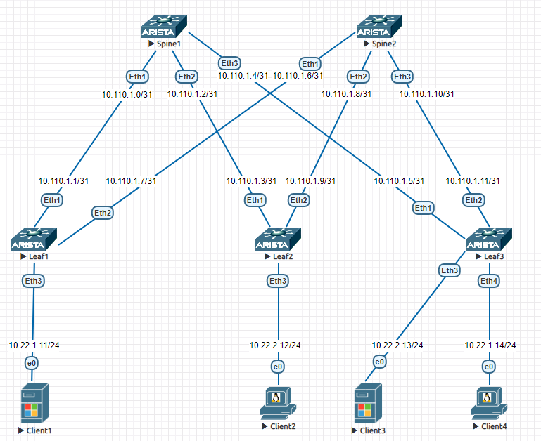

# Лаборная работа 1
## **Проектирование адресного пространства**
## Цель:
* Собрать схему CLOS
* Распределить адресное пространство

 ## Решение:

 **Cхема CLOS**
 
 
 
 **Адресное пространство Underlay сети**

 Адреса p2p каналов:
|  Узел сети уровня Spine | порт| Адрес Spine    | Узел сети уровня Leaf | порт | Адрес Leaf     | Сеть           |
|---------|---|-------------|-----------|---------|---|----------------|
| Spine1 | Eth1   | 10.110.1.0  | Leaf1 |Eth1    | 10.110.1.1 | 10.110.1.0/31  |
| Spine1 | Eth2   | 10.110.1.2  | Leaf2 |Eth1    | 10.110.1.3 | 10.110.1.2/31  |
| Spine1 | Eth3   | 10.110.1.4  | Leaf3 |Eth1    | 10.110.1.5 | 10.110.1.4/31  |
| Spine2 | Eth1   | 10.110.1.6  | Leaf1 |Eth2    | 10.110.1.7 | 10.110.1.6/31  |
| Spine2 | Eth2   | 10.110.1.8  | Leaf2 |Eth2    | 10.110.1.9 | 10.110.1.8/31  |
| Spine2 | Eth3   | 10.110.1.10 | Leaf3 |Eth2   | 10.110.1.11| 10.110.1.10/31 |

Адреса клиентов:
| Клиент  | Адрес клиента     | Сеть         |
|---------|------------|--------------|
| Client1 | 10.22.1.11 | 10.22.1.0/24 |
| Client2 | 10.22.2.12 | 10.22.1.0/24 |
| Client3 | 10.22.2.13 | 10.22.1.0/24 |
| Client4 | 10.22.1.14 | 10.22.1.0/24 |

Настройка ip адреса на интрефейсе коммутратора:
```
Switch(config)#interface Ethernet <номер интерфейса>

Switch(config-if)#no switchport

Switch(config-if)#ip address <IP-адрес> <маска>
```