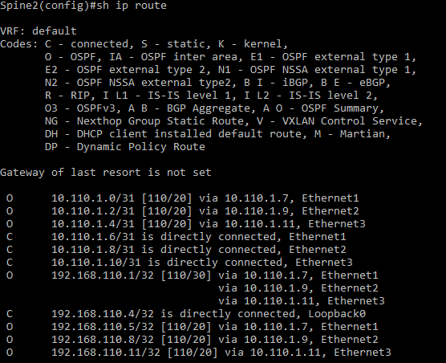

# Лаборная работа 2
## **Underlay. OSPF**
## Цель:

* настроить OSPF в Underlay сети, для IP связанности между всеми устройствами

 ## Решение:
 Работа будет выполнятся на коммутаторах Arista на базе схемы из [Лабораторной работы 1](../lab1/)

 **План работы**
 
 * Сформировать адресное пространство для Underlay сети и OSPF
 * Собрать схему сети
 * Настроить коммутаторы

 **Адресное пространство Underlay сети**

 Адреса p2p каналов:
|  Узел сети уровня Spine | порт| Адрес Spine    | Узел сети уровня Leaf | порт | Адрес Leaf     | Сеть           |
|---------|---|-------------|-----------|---------|---|----------------|
| Spine1 | Eth1   | 10.110.1.0  | Leaf1 |Eth1    | 10.110.1.1 | 10.110.1.0/31  |
| Spine1 | Eth2   | 10.110.1.2  | Leaf2 |Eth1    | 10.110.1.3 | 10.110.1.2/31  |
| Spine1 | Eth3   | 10.110.1.4  | Leaf3 |Eth1    | 10.110.1.5 | 10.110.1.4/31  |
| Spine2 | Eth1   | 10.110.1.6  | Leaf1 |Eth2    | 10.110.1.7 | 10.110.1.6/31  |
| Spine2 | Eth2   | 10.110.1.8  | Leaf2 |Eth2    | 10.110.1.9 | 10.110.1.8/31  |
| Spine2 | Eth3   | 10.110.1.10 | Leaf3 |Eth2   | 10.110.1.11| 10.110.1.10/31 |

Адреса клиентов:
| Клиент  | Адрес клиента     | Сеть         |
|---------|------------|--------------|
| Client1 | 10.22.1.11 | 10.22.1.0/24 |
| Client2 | 10.22.2.12 | 10.22.1.0/24 |
| Client3 | 10.22.2.13 | 10.22.1.0/24 |
| Client4 | 10.22.1.14 | 10.22.1.0/24 |

Адреса loopback интерфейсов:
| Узел сети | Адрес Lo0 |
|-----------|-----------|
| Spine1    |     192.168.110.1      |
| Spine2    |     192.168.110.4      |
| Leaf1    |      192.168.110.5     |
| Leaf2    |      192.168.110.8     |
| Leaf3    |      192.168.110.11     |


 **Схема сети**
 
 

 **Настройка коммутаторов**

На каждом из коммутаторов выполняем настройки OSPF и BFD:
```
!Включаем маршрутизацию
(config)#ip routing

!Включаем процесс OSPF
(config)#router ospf 1
!Задаем router-id по ip адресу интерфейса Lo0. Для каждого коммутатора берем адрес из подготовленного выше списка адресов loopback интерфейсов.
(config-router-ospf)#router-id <IP-адрес из списка>
!Включаем BFD для ускорения обнаружения неисправности линков
(config-router-ospf)#bfd all-interfaces

!Настраиваем loopback-интерфейс
(config)#interface Loopback0
!Включаем OSPF
(config-if-Lo0)#ip ospf area 0.0.0.0
!Задаем IP адрес. Для каждого коммутатора берем адрес из подготовленного выше списка адресов loopback интерфейсов.
(config-if-Lo0)#ip address <IP-адрес  из списка>/32

!Настраиваем физические интерфейсы через которые подключенны коммутаторы
(config)#interface Ethernet1
!Включаем OSPF
(config-if-Et1)#ip ospf area 0.0.0.0
!задаем тип линка point-to-point
(config-if-Et1)#ip ospf network point-to-point
!Включаем аутентификацию OSPF
(config-if-Et1)#ip ospf authentication message-digest
(config-if-Et1)#ip ospf message-digest-key 1 md5 xxxxxxx
```
Проверяем работу OSPF и BFD командами:
```
show ip ospf neighbor
show ip route
show bfd neighbors
```

OSPF видит соседей:


Таблица маршрутизации:



BFD видит соседей:


<details>
<summary>Конфигурация Spine1</summary>
<pre><code>
! Command: show running-config
! device: Spine1 (vEOS, EOS-4.21.1.1F)
!
! boot system flash:/vEOS-lab.swi
!
transceiver qsfp default-mode 4x10G
!
hostname Spine1
!
spanning-tree mode mstp
!
no aaa root
!
interface Ethernet1
   no switchport
   ip address 10.110.1.0/31
   ip ospf network point-to-point
   ip ospf authentication message-digest
   ip ospf area 0.0.0.0
   ip ospf message-digest-key 1 md5 7 GiwCiiFBP6Av/3NwX+QW9w==
!
interface Ethernet2
   no switchport
   ip address 10.110.1.2/31
   ip ospf network point-to-point
   ip ospf authentication message-digest
   ip ospf area 0.0.0.0
   ip ospf message-digest-key 1 md5 7 /yIrNdF7UxOJ/C4UPWVz/g==
!
interface Ethernet3
   no switchport
   ip address 10.110.1.4/31
   ip ospf network point-to-point
   ip ospf authentication message-digest
   ip ospf area 0.0.0.0
   ip ospf message-digest-key 1 md5 7 /yIrNdF7UxOJ/C4UPWVz/g==
!
interface Ethernet4
!
interface Ethernet5
!
interface Ethernet6
!
interface Ethernet7
!
interface Ethernet8
!
interface Loopback0
   ip address 192.168.110.1/32
   ip ospf area 0.0.0.0
!
interface Management1
!
ip routing
!
router ospf 1
   router-id 192.168.110.1
   bfd all-interfaces
   max-lsa 12000
!
end
</code></pre>
</details>

<details>
<summary>Конфигурация Spine2</summary>
<pre><code>
! Command: show running-config
! device: Spine2 (vEOS, EOS-4.21.1.1F)
!
! boot system flash:/vEOS-lab.swi
!
transceiver qsfp default-mode 4x10G
!
hostname Spine2
!
spanning-tree mode mstp
!
no aaa root
!
interface Ethernet1
   no switchport
   ip address 10.110.1.6/31
   ip ospf network point-to-point
   ip ospf authentication message-digest
   ip ospf area 0.0.0.0
   ip ospf message-digest-key 1 md5 7 GiwCiiFBP6Av/3NwX+QW9w==
!
interface Ethernet2
   no switchport
   ip address 10.110.1.8/31
   ip ospf network point-to-point
   ip ospf authentication message-digest
   ip ospf area 0.0.0.0
   ip ospf message-digest-key 1 md5 7 /yIrNdF7UxOJ/C4UPWVz/g==
!
interface Ethernet3
   no switchport
   ip address 10.110.1.10/31
   ip ospf network point-to-point
   ip ospf authentication message-digest
   ip ospf area 0.0.0.0
   ip ospf message-digest-key 1 md5 7 /yIrNdF7UxOJ/C4UPWVz/g==
!
interface Ethernet4
!
interface Ethernet5
!
interface Ethernet6
!
interface Ethernet7
!
interface Ethernet8
!
interface Loopback0
   ip address 192.168.110.4/32
   ip ospf area 0.0.0.0
!
interface Management1
!
ip routing
!
router ospf 1
   router-id 192.168.110.4
   bfd all-interfaces
   max-lsa 12000
!
end
</code></pre>
</details>

<details>
<summary>Конфигурация Leaf1</summary>
<pre><code>
! Command: show running-config
! device: Leaf1 (vEOS, EOS-4.21.1.1F)
!
! boot system flash:/vEOS-lab.swi
!
transceiver qsfp default-mode 4x10G
!
hostname Leaf1
!
spanning-tree mode mstp
!
no aaa root
!
interface Ethernet1
   no switchport
   ip address 10.110.1.1/31
   ip ospf network point-to-point
   ip ospf authentication message-digest
   ip ospf area 0.0.0.0
   ip ospf message-digest-key 1 md5 7 GiwCiiFBP6Av/3NwX+QW9w==
!
interface Ethernet2
   no switchport
   ip address 10.110.1.7/31
   ip ospf network point-to-point
   ip ospf authentication message-digest
   ip ospf area 0.0.0.0
   ip ospf message-digest-key 1 md5 7 /yIrNdF7UxOJ/C4UPWVz/g==
!
interface Ethernet3
!
interface Ethernet4
!
interface Ethernet5
!
interface Ethernet6
!
interface Ethernet7
!
interface Ethernet8
!
interface Loopback0
   ip address 192.168.110.5/32
   ip ospf area 0.0.0.0
!
interface Management1
!
ip routing
!
router ospf 1
   router-id 192.168.110.5
   bfd all-interfaces
   max-lsa 12000
!
end
</code></pre>
</details>

<details>
<summary>Конфигурация Leaf2</summary>
<pre><code>
! Command: show running-config
! device: Leaf2 (vEOS, EOS-4.21.1.1F)
!
! boot system flash:/vEOS-lab.swi
!
transceiver qsfp default-mode 4x10G
!
hostname Leaf2
!
spanning-tree mode mstp
!
no aaa root
!
interface Ethernet1
   no switchport
   ip address 10.110.1.3/31
   ip ospf network point-to-point
   ip ospf authentication message-digest
   ip ospf area 0.0.0.0
   ip ospf message-digest-key 1 md5 7 GiwCiiFBP6Av/3NwX+QW9w==
!
interface Ethernet2
   no switchport
   ip address 10.110.1.9/31
   ip ospf network point-to-point
   ip ospf authentication message-digest
   ip ospf area 0.0.0.0
   ip ospf message-digest-key 1 md5 7 /yIrNdF7UxOJ/C4UPWVz/g==
!
interface Ethernet3
!
interface Ethernet4
!
interface Ethernet5
!
interface Ethernet6
!
interface Ethernet7
!
interface Ethernet8
!
interface Loopback0
   ip address 192.168.110.8/32
   ip ospf area 0.0.0.0
!
interface Management1
!
ip routing
!
router ospf 1
   router-id 192.168.110.8
   bfd all-interfaces
   max-lsa 12000
!
end
</code></pre>
</details>

<details>
<summary>Конфигурация Leaf3</summary>
<pre><code>
! Command: show running-config
! device: Leaf3 (vEOS, EOS-4.21.1.1F)
!
! boot system flash:/vEOS-lab.swi
!
transceiver qsfp default-mode 4x10G
!
hostname Leaf3
!
spanning-tree mode mstp
!
no aaa root
!
interface Ethernet1
   no switchport
   ip address 10.110.1.5/31
   ip ospf network point-to-point
   ip ospf authentication message-digest
   ip ospf area 0.0.0.0
   ip ospf message-digest-key 1 md5 7 GiwCiiFBP6Av/3NwX+QW9w==
!
interface Ethernet2
   no switchport
   ip address 10.110.1.11/31
   ip ospf network point-to-point
   ip ospf authentication message-digest
   ip ospf area 0.0.0.0
   ip ospf message-digest-key 1 md5 7 /yIrNdF7UxOJ/C4UPWVz/g==
!
interface Ethernet3
!
interface Ethernet4
!
interface Ethernet5
!
interface Ethernet6
!
interface Ethernet7
!
interface Ethernet8
!
interface Loopback0
   ip address 192.168.110.11/32
   ip ospf area 0.0.0.0
!
interface Management1
!
ip routing
!
router ospf 1
   router-id 192.168.110.11
   bfd all-interfaces
   max-lsa 12000
!
end
</code></pre>
</details>


