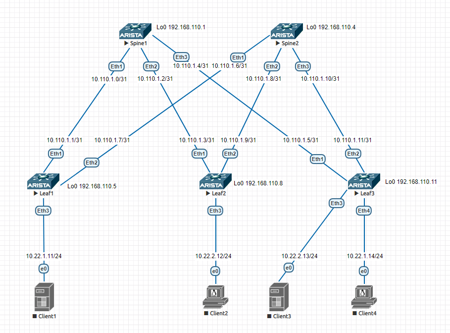
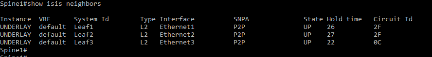
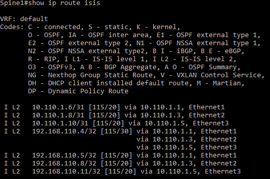
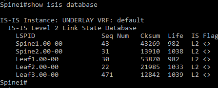

# Лаборная работа 3
## **Underlay. IS-IS**
## Цель:

* настроить IS-IS в Underlay сети

 ## Решение:
 Работа будет выполнятся на коммутаторах Arista на базе схемы из [Лабораторной работы 1](../lab1/)

 **План работы**
 
 * Сформировать адресное пространство для Underlay сети и ISIS
 * Собрать схему сети
 * Настроить коммутаторы

 **Адресное пространство Underlay сети**

 Адреса p2p каналов:
|  Узел сети уровня Spine | порт| Адрес Spine    | Узел сети уровня Leaf | порт | Адрес Leaf     | Сеть           |
|---------|---|-------------|-----------|---------|---|----------------|
| Spine1 | Eth1   | 10.110.1.0  | Leaf1 |Eth1    | 10.110.1.1 | 10.110.1.0/31  |
| Spine1 | Eth2   | 10.110.1.2  | Leaf2 |Eth1    | 10.110.1.3 | 10.110.1.2/31  |
| Spine1 | Eth3   | 10.110.1.4  | Leaf3 |Eth1    | 10.110.1.5 | 10.110.1.4/31  |
| Spine2 | Eth1   | 10.110.1.6  | Leaf1 |Eth2    | 10.110.1.7 | 10.110.1.6/31  |
| Spine2 | Eth2   | 10.110.1.8  | Leaf2 |Eth2    | 10.110.1.9 | 10.110.1.8/31  |
| Spine2 | Eth3   | 10.110.1.10 | Leaf3 |Eth2   | 10.110.1.11| 10.110.1.10/31 |

Адреса клиентов:
| Клиент  | Адрес клиента     | Сеть         |
|---------|------------|--------------|
| Client1 | 10.22.1.11 | 10.22.1.0/24 |
| Client2 | 10.22.2.12 | 10.22.1.0/24 |
| Client3 | 10.22.2.13 | 10.22.1.0/24 |
| Client4 | 10.22.1.14 | 10.22.1.0/24 |

Адреса loopback интерфейсов:
| Узел сети | Адрес Lo0 |
|-----------|-----------|
| Spine1    |     192.168.110.1      |
| Spine2    |     192.168.110.4      |
| Leaf1    |      192.168.110.5     |
| Leaf2    |      192.168.110.8     |
| Leaf3    |      192.168.110.11     |

NET
| Узел сети | NET |
|-----------|-----------|
| Spine1    |     49.0001.1921.6811.0001.00     |
| Spine2    |     49.0001.1921.6811.0004.00      |
| Leaf1    |      49.0001.1921.6811.0005.00     |
| Leaf2    |      49.0001.1921.6811.0008.00    |
| Leaf3    |      49.0001.1921.6811.0011.00    |


 **Схема сети**
 
 

 **Настройка коммутаторов**

На каждом из коммутаторов выполняем настройки ISIS:
```
!Включаем маршрутизацию
(config)#ip routing

!Включаем процесс ISIS
(config)#router isis UNDERLAY
!Задаем NET. Для каждого коммутатора берем NET из подготовленного выше списка.
(config-router-isis)net <NET из списка>
!Задаем тип маршрутизатора
(config-router-isis)#is-type level-2
!Включаем BFD для ускорения обнаружения неисправности линков
(config-router-isis)#address-family ipv4 unicast
(config-router-isis-af)#bfd all-interfaces

!Настраиваем loopback-интерфейс, включаем ISIS на интерфейсе
(config)#interface Loopback0
Leaf3(config-if-Lo0)#isis enable UNDERLAY

!Настраиваем физические интерфейсы через которые подключенны коммутаторы
(config)#interface Ethernet1
!Включаем ISIS
(config-if-Et1)#isis enable UNDERLAY
!задаем тип линка point-to-point
(config-if-Et1)#isis network point-to-point
!Включаем аутентификацию ISIS
(config-if-Et1)#isis authentication mode md5
(config-if-Et1)#isis authentication key 0 xxxxxxx
```
Проверяем работу ISIS командами:
```
show isis neighbors
show ip route isis
show isis database
show isis database level-2 detail # можно использовать для просмотра расширенной информации о link-state database
```

ISIS видит соседей:



Таблица маршрутизации:



Содержимое LSDB:



<details>
<summary>Конфигурация Spine1</summary>
<pre><code>
! Command: show running-config
! device: Spine1 (vEOS, EOS-4.21.1.1F)
!
! boot system flash:/vEOS-lab.swi
!
transceiver qsfp default-mode 4x10G
!
hostname Spine1
!
spanning-tree mode mstp
!
no aaa root
!
interface Ethernet1
   no switchport
   ip address 10.110.1.0/31
   isis enable UNDERLAY
   isis bfd
   isis network point-to-point
   isis authentication mode md5
   isis authentication key 7 kBi6qc4fGf6dN+LSoHvYiQ==
!
interface Ethernet2
   no switchport
   ip address 10.110.1.2/31
   isis enable UNDERLAY
   isis bfd
   isis network point-to-point
   isis authentication mode md5
   isis authentication key 7 kBi6qc4fGf6dN+LSoHvYiQ==
!
interface Ethernet3
   no switchport
   ip address 10.110.1.4/31
   isis enable UNDERLAY
   isis bfd
   isis network point-to-point
   isis authentication mode md5
   isis authentication key 7 kBi6qc4fGf6dN+LSoHvYiQ==
!
interface Ethernet4
!
interface Ethernet5
!
interface Ethernet6
!
interface Ethernet7
!
interface Ethernet8
!
interface Loopback0
   ip address 192.168.110.1/32
   isis enable UNDERLAY
!
interface Management1
!
ip routing
!
router isis UNDERLAY
   net 49.0001.1921.6811.0001.00
   is-type level-2
   !
   address-family ipv4 unicast
      bfd all-interfaces
!
end
</code></pre>
</details>

<details>
<summary>Конфигурация Spine2</summary>
<pre><code>
! Command: show running-config
! device: Spine2 (vEOS, EOS-4.21.1.1F)
!
! boot system flash:/vEOS-lab.swi
!
transceiver qsfp default-mode 4x10G
!
hostname Spine2
!
spanning-tree mode mstp
!
no aaa root
!
interface Ethernet1
   no switchport
   ip address 10.110.1.6/31
   isis enable UNDERLAY
   isis bfd
   isis network point-to-point
   isis authentication mode md5
   isis authentication key 7 kBi6qc4fGf6dN+LSoHvYiQ==
!
interface Ethernet2
   no switchport
   ip address 10.110.1.8/31
   isis enable UNDERLAY
   isis bfd
   isis network point-to-point
   isis authentication mode md5
   isis authentication key 7 kBi6qc4fGf6dN+LSoHvYiQ==
!
interface Ethernet3
   no switchport
   ip address 10.110.1.10/31
   isis enable UNDERLAY
   isis bfd
   isis network point-to-point
   isis authentication mode md5
   isis authentication key 7 kBi6qc4fGf6dN+LSoHvYiQ==
!
interface Ethernet4
!
interface Ethernet5
!
interface Ethernet6
!
interface Ethernet7
!
interface Ethernet8
!
interface Loopback0
   ip address 192.168.110.4/32
   isis enable UNDERLAY
!
interface Management1
!
ip routing
!
router isis UNDERLAY
   net 49.0001.1921.6811.0004.00
   is-type level-2
   !
   address-family ipv4 unicast
      bfd all-interfaces
!
end
</code></pre>
</details>

<details>
<summary>Конфигурация Leaf1</summary>
<pre><code>
! Command: show running-config
! device: Leaf1 (vEOS, EOS-4.21.1.1F)
!
! boot system flash:/vEOS-lab.swi
!
transceiver qsfp default-mode 4x10G
!
hostname Leaf1
!
spanning-tree mode mstp
!
no aaa root
!
interface Ethernet1
   no switchport
   ip address 10.110.1.1/31
   isis enable UNDERLAY
   isis bfd
   isis network point-to-point
   isis authentication mode md5
   isis authentication key 7 kBi6qc4fGf6dN+LSoHvYiQ==
!
interface Ethernet2
   no switchport
   ip address 10.110.1.7/31
   isis enable UNDERLAY
   isis bfd
   isis network point-to-point
   isis authentication mode md5
   isis authentication key 7 kBi6qc4fGf6dN+LSoHvYiQ==
!
interface Ethernet3
!
interface Ethernet4
!
interface Ethernet5
!
interface Ethernet6
!
interface Ethernet7
!
interface Ethernet8
!
interface Loopback0
   ip address 192.168.110.5/32
   isis enable UNDERLAY
!
interface Management1
!
ip routing
!
router isis UNDERLAY
   net 49.0001.1921.6811.0005.00
   is-type level-2
   !
   address-family ipv4 unicast
      bfd all-interfaces
!
end
</code></pre>
</details>

<details>
<summary>Конфигурация Leaf2</summary>
<pre><code>
! Command: show running-config
! device: Leaf2 (vEOS, EOS-4.21.1.1F)
!
! boot system flash:/vEOS-lab.swi
!
transceiver qsfp default-mode 4x10G
!
hostname Leaf2
!
spanning-tree mode mstp
!
no aaa root
!
interface Ethernet1
   no switchport
   ip address 10.110.1.3/31
   isis enable UNDERLAY
   isis bfd
   isis network point-to-point
   isis authentication mode md5
   isis authentication key 7 kBi6qc4fGf6dN+LSoHvYiQ==
!
interface Ethernet2
   no switchport
   ip address 10.110.1.9/31
   isis enable UNDERLAY
   isis bfd
   isis network point-to-point
   isis authentication mode md5
   isis authentication key 7 kBi6qc4fGf6dN+LSoHvYiQ==
!
interface Ethernet3
   isis bfd
!
interface Ethernet4
!
interface Ethernet5
!
interface Ethernet6
!
interface Ethernet7
!
interface Ethernet8
!
interface Loopback0
   ip address 192.168.110.8/32
   isis enable UNDERLAY
!
interface Management1
!
ip routing
!
router isis UNDERLAY
   net 49.0001.1921.6811.0008.00
   is-type level-2
   !
   address-family ipv4 unicast
      bfd all-interfaces
!
end
</code></pre>
</details>

<details>
<summary>Конфигурация Leaf3</summary>
<pre><code>
! Command: show running-config
! device: Leaf3 (vEOS, EOS-4.21.1.1F)
!
! boot system flash:/vEOS-lab.swi
!
transceiver qsfp default-mode 4x10G
!
hostname Leaf3
!
spanning-tree mode mstp
!
no aaa root
!
interface Ethernet1
   no switchport
   ip address 10.110.1.5/31
   isis enable UNDERLAY
   isis bfd
   isis network point-to-point
   isis authentication mode md5
   isis authentication key 7 kBi6qc4fGf6dN+LSoHvYiQ==
!
interface Ethernet2
   no switchport
   ip address 10.110.1.11/31
   isis enable UNDERLAY
   isis bfd
   isis network point-to-point
   isis authentication mode md5
   isis authentication key 7 kBi6qc4fGf6dN+LSoHvYiQ==
!
interface Ethernet3
!
interface Ethernet4
!
interface Ethernet5
!
interface Ethernet6
!
interface Ethernet7
!
interface Ethernet8
!
interface Loopback0
   ip address 192.168.110.11/32
   isis enable UNDERLAY
!
interface Management1
!
ip routing
!
router isis UNDERLAY
   net 49.0001.1921.6811.0011.00
   is-type level-2
   !
   address-family ipv4 unicast
      bfd all-interfaces
!
end
</code></pre>
</details>


