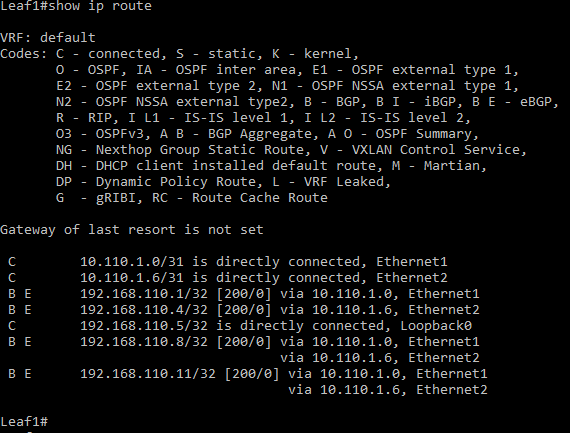

# Лаборная работа 4
## **Underlay. BGP**
## Цель:

* настроить BGP для Underlay сети

 ## Решение:
 Работа будет выполнятся на коммутаторах Arista на базе схемы из [Лабораторной работы 1](../lab1/)

 **План работы**
 
 * Сформировать адресное пространство для Underlay сети и BGP
 * Собрать схему сети
 * Настроить коммутаторы

 **Адресное пространство Underlay сети**

 Адреса p2p каналов:
|  Узел сети уровня Spine | порт| Адрес Spine    | Узел сети уровня Leaf | порт | Адрес Leaf     | Сеть           |
|---------|---|-------------|-----------|---------|---|----------------|
| Spine1 | Eth1   | 10.110.1.0  | Leaf1 |Eth1    | 10.110.1.1 | 10.110.1.0/31  |
| Spine1 | Eth2   | 10.110.1.2  | Leaf2 |Eth1    | 10.110.1.3 | 10.110.1.2/31  |
| Spine1 | Eth3   | 10.110.1.4  | Leaf3 |Eth1    | 10.110.1.5 | 10.110.1.4/31  |
| Spine2 | Eth1   | 10.110.1.6  | Leaf1 |Eth2    | 10.110.1.7 | 10.110.1.6/31  |
| Spine2 | Eth2   | 10.110.1.8  | Leaf2 |Eth2    | 10.110.1.9 | 10.110.1.8/31  |
| Spine2 | Eth3   | 10.110.1.10 | Leaf3 |Eth2   | 10.110.1.11| 10.110.1.10/31 |

Адреса клиентов:
| Клиент  | Адрес клиента     | Сеть         |
|---------|------------|--------------|
| Client1 | 10.22.1.11 | 10.22.1.0/24 |
| Client2 | 10.22.2.12 | 10.22.1.0/24 |
| Client3 | 10.22.2.13 | 10.22.1.0/24 |
| Client4 | 10.22.1.14 | 10.22.1.0/24 |

Адреса loopback интерфейсов:
| Узел сети | Адрес Lo0 |
|-----------|-----------|
| Spine1    |     192.168.110.1      |
| Spine2    |     192.168.110.4      |
| Leaf1    |      192.168.110.5     |
| Leaf2    |      192.168.110.8     |
| Leaf3    |      192.168.110.11     |

Номера AS
| Узел сети | NET |
|-----------|-----------|
| Spine    |     AS65000   |
| Leaf1    |      AS65001   |
| Leaf2    |      AS65002   |
| Leaf3    |      AS65003    |


 **Схема сети**
 
 

 **Настройка коммутаторов**

На каждом из Spine коммутаторов выполняем настройки BGP:
```
!Включаем маршрутизацию
(config)#ip routing

!Создаем peer filter для последующего динамического обнаружения соседей
(config)#peer-filter AS_FILTER

!Разрешаем AS в которых расположены leaf в соотвествии с таблицей номеров AS
(config-peer-filter-AS_FILTER)#10 match as-range 65001-65999 result accept

!Включаем процесс BGP для AS выбранной для Spine
(config)#router bgp <номер AS>

!Задаем router-id по ip адресу интерфейса Lo0
(config-router-bgp)#router-id <IP-адрес Lo0>

!Разрешаем до 4 маршрутов для каждой подсети
(config-router-bgp)#maximum-paths 4

!Задаем условия для динамического обнаружения соседей, свитчи, находящиеся в подсети 10.110.1.0/24 и в AS заданых ранее фильтром попадают в peer группу LEAFS_UNDERLAY
(config-router-bgp)#bgp listen range 10.110.1.0/24 peer-group LEAFS_UNDERLAY peer-filter AS_FILTER

!Устанавливаем соседство со свитчами из группы LEAFS_UNDERLAY

(config-router-bgp)#neighbor LEAFS_UNDERLAY peer group
!Включаем для них BFD
(config-router-bgp)#neighbor LEAFS_UNDERLAY bfd

!Указываем какие подсети будем рассылать соседям
!В prefix list задаем условие под которое подпадают адреса loopback
(config)#ip prefix-list LOOPBACKS seq 10 permit 192.168.110.0/24 le 32

!Создаем route map для адресов, которые будем рассылать соседям
(config)#route-map LOOPBACKS permit 10
(config-route-map-LOOPBACKS)#match ip address prefix-list LOOPBACKS

!Указываем какие адреса будем рассылать соседям, в данном случае адреса, удовлетворяющие ранее заданому route map
(config-router-bgp)#redistribute connected route-map LOOPBACKS

```

На каждом из Leaf коммутаторов выполняем настройки BGP:
```
!Включаем маршрутизацию
(config)#ip routing

!Включаем процесс BGP для соответсвующей AS указанной в таблице
(config)#router bgp <номер AS>

!Задаем router-id по ip адресу интерфейса Lo0
(config-router-bgp)#router-id <IP-адрес Lo0>

!Разрешаем до 4 маршрутов для каждой подсети
(config-router-bgp)#maximum-paths 4

!На leaf'ах соседей пропишем вручную, создаем peer группу SPINES_UNDERLAY, свитчи должны быть в AS выбранной для spine, в нашем случае 65000
(config-router-bgp)#neighbor SPINES_UNDERLAY peer group
(config-router-bgp)#neighbor SPINES_UNDERLAY remote-as 65000

!Добавляем в группу Spine1 и Spine2
(config-router-bgp)#neighbor <IP-адрес интерфейса на Spine1 подключенный к Leaf> peer group SPINES_UNDERLAY
(config-router-bgp)#neighbor <IP-адрес интерфейса на Spine2 подключенный к Leaf> peer group SPINES_UNDERLAY

!Включаем BFD
(config-router-bgp)#neighbor SPINES_UNDERLAY bfd

!Указываем какие подсети будем рассылать соседям
!В prefix list задаем условие под которое подпадают адреса loopback
(config)#ip prefix-list LOOPBACKS seq 10 permit 192.168.110.0/24 le 32

!Создаем route map для адресов, которые будем рассылать соседям
(config)#route-map LOOPBACKS permit 10
(config-route-map-LOOPBACKS)#match ip address prefix-list LOOPBACKS

!Указываем какие адреса будем рассылать соседям, в данном случае адреса, удовлетворяющие ранее заданому route map
(config-router-bgp)#redistribute connected route-map LOOPBACKS

```

Проверяем работу BGP командами:
```
show ip bgp peer-group LEAFS_UNDERLAY
show ip bgp summary
show ip route
show bfd peers
```

Все leaf в группе LEAFS_UNDERLAY:


Соседство установилось:


Таблица маршрутизации на Spine1:


Таблица маршрутизации на Leaf1:



BFD видит соседей:


<details>
<summary>Конфигурация Spine1</summary>
<pre><code>
! Command: show running-config
! device: Spine1 (vEOS-lab, EOS-4.26.4M)
!
! boot system flash:/vEOS-lab.swi
!
no aaa root
!
transceiver qsfp default-mode 4x10G
!
service routing protocols model ribd
!
hostname Spine1
!
spanning-tree mode mstp
!
interface Ethernet1
   no switchport
   ip address 10.110.1.0/31
!
interface Ethernet2
   no switchport
   ip address 10.110.1.2/31
!
interface Ethernet3
   no switchport
   ip address 10.110.1.4/31
!
interface Ethernet4
!
interface Ethernet5
!
interface Ethernet6
!
interface Ethernet7
!
interface Ethernet8
!
interface Loopback0
   ip address 192.168.110.1/32
!
interface Management1
!
ip routing
!
ip prefix-list LOOPBACKS seq 10 permit 192.168.110.0/24 le 32
!
route-map LOOPBACKS permit 10
   match ip address prefix-list LOOPBACKS
!
peer-filter AS_FILTER
   10 match as-range 65001-65999 result accept
!
router bgp 65000
   router-id 192.168.110.1
   maximum-paths 4
   bgp listen range 10.110.1.0/24 peer-group LEAFS_UNDERLAY peer-filter AS_FILTER
   neighbor LEAFS_UNDERLAY peer group
   neighbor LEAFS_UNDERLAY bfd
   redistribute connected route-map LOOPBACKS
!
end
</code></pre>
</details>

<details>
<summary>Конфигурация Spine2</summary>
<pre><code>
! Command: show running-config
! device: Spine2 (vEOS-lab, EOS-4.26.4M)
!
! boot system flash:/vEOS-lab.swi
!
no aaa root
!
transceiver qsfp default-mode 4x10G
!
service routing protocols model ribd
!
hostname Spine2
!
spanning-tree mode mstp
!
interface Ethernet1
   no switchport
   ip address 10.110.1.6/31
!
interface Ethernet2
   no switchport
   ip address 10.110.1.8/31
!
interface Ethernet3
   no switchport
   ip address 10.110.1.10/31
!
interface Ethernet4
!
interface Ethernet5
!
interface Ethernet6
!
interface Ethernet7
!
interface Ethernet8
!
interface Loopback0
   ip address 192.168.110.4/32
!
interface Management1
!
ip routing
!
ip prefix-list LOOPBACKS seq 10 permit 192.168.110.0/24 le 32
!
route-map LOOPBACKS permit 10
   match ip address prefix-list LOOPBACKS
!
peer-filter AS_FILTER
   10 match as-range 65001-65999 result accept
!
router bgp 65000
   router-id 192.168.110.4
   maximum-paths 4
   bgp listen range 10.110.1.0/24 peer-group LEAFS_UNDERLAY peer-filter AS_FILTER
   neighbor LEAFS_UNDERLAY peer group
   neighbor LEAFS_UNDERLAY bfd
   redistribute connected route-map LOOPBACKS
!
end
</code></pre>
</details>

<details>
<summary>Конфигурация Leaf1</summary>
<pre><code>
! Command: show running-config
! device: Leaf1 (vEOS-lab, EOS-4.26.4M)
!
! boot system flash:/vEOS-lab.swi
!
no aaa root
!
transceiver qsfp default-mode 4x10G
!
service routing protocols model ribd
!
hostname Leaf1
!
spanning-tree mode mstp
!
interface Ethernet1
   no switchport
   ip address 10.110.1.1/31
!
interface Ethernet2
   no switchport
   ip address 10.110.1.7/31
!
interface Ethernet3
!
interface Ethernet4
!
interface Ethernet5
!
interface Ethernet6
!
interface Ethernet7
!
interface Ethernet8
!
interface Loopback0
   ip address 192.168.110.5/32
!
interface Management1
!
ip routing
!
ip prefix-list LOOPBACKS seq 10 permit 192.168.110.0/24 le 32
!
route-map LOOPBACKS permit 10
   match ip address prefix-list LOOPBACKS
!
router bgp 65001
   router-id 192.168.110.5
   maximum-paths 4
   neighbor SPINES_UNDERLAY peer group
   neighbor SPINES_UNDERLAY remote-as 65000
   neighbor SPINES_UNDERLAY bfd
   neighbor 10.110.1.0 peer group SPINES_UNDERLAY
   neighbor 10.110.1.6 peer group SPINES_UNDERLAY
   redistribute connected route-map LOOPBACKS
!
end
</code></pre>
</details>

<details>
<summary>Конфигурация Leaf2</summary>
<pre><code>
! Command: show running-config
! device: Leaf2 (vEOS-lab, EOS-4.26.4M)
!
! boot system flash:/vEOS-lab.swi
!
no aaa root
!
transceiver qsfp default-mode 4x10G
!
service routing protocols model ribd
!
hostname Leaf2
!
spanning-tree mode mstp
!
interface Ethernet1
   no switchport
   ip address 10.110.1.3/31
!
interface Ethernet2
   no switchport
   ip address 10.110.1.9/31
!
interface Ethernet3
!
interface Ethernet4
!
interface Ethernet5
!
interface Ethernet6
!
interface Ethernet7
!
interface Ethernet8
!
interface Loopback0
   ip address 192.168.110.8/32
!
interface Management1
!
ip routing
!
ip prefix-list LOOPBACKS seq 10 permit 192.168.110.0/24 le 32
!
route-map LOOPBACKS permit 10
   match ip address prefix-list LOOPBACKS
!
router bgp 65002
   router-id 192.168.110.5
   maximum-paths 4
   neighbor SPINES_UNDERLAY peer group
   neighbor SPINES_UNDERLAY remote-as 65000
   neighbor SPINES_UNDERLAY bfd
   neighbor 10.110.1.2 peer group SPINES_UNDERLAY
   neighbor 10.110.1.8 peer group SPINES_UNDERLAY
   redistribute connected route-map LOOPBACKS
!
end
</code></pre>
</details>

<details>
<summary>Конфигурация Leaf3</summary>
<pre><code>
! Command: show running-config
! device: Leaf3 (vEOS-lab, EOS-4.26.4M)
!
! boot system flash:/vEOS-lab.swi
!
no aaa root
!
transceiver qsfp default-mode 4x10G
!
service routing protocols model ribd
!
hostname Leaf3
!
spanning-tree mode mstp
!
interface Ethernet1
   no switchport
   ip address 10.110.1.5/31
!
interface Ethernet2
   no switchport
   ip address 10.110.1.11/31
!
interface Ethernet3
!
interface Ethernet4
!
interface Ethernet5
!
interface Ethernet6
!
interface Ethernet7
!
interface Ethernet8
!
interface Loopback0
   ip address 192.168.110.11/32
!
interface Management1
!
ip routing
!
ip prefix-list LOOPBACKS seq 10 permit 192.168.110.0/24 le 32
!
route-map LOOPBACKS permit 10
   match ip address prefix-list LOOPBACKS
!
router bgp 65003
   router-id 192.168.110.5
   maximum-paths 4
   neighbor SPINES_UNDERLAY peer group
   neighbor SPINES_UNDERLAY remote-as 65000
   neighbor SPINES_UNDERLAY bfd
   neighbor 10.110.1.4 peer group SPINES_UNDERLAY
   neighbor 10.110.1.10 peer group SPINES_UNDERLAY
   redistribute connected route-map LOOPBACKS
!
end
</code></pre>
</details>


