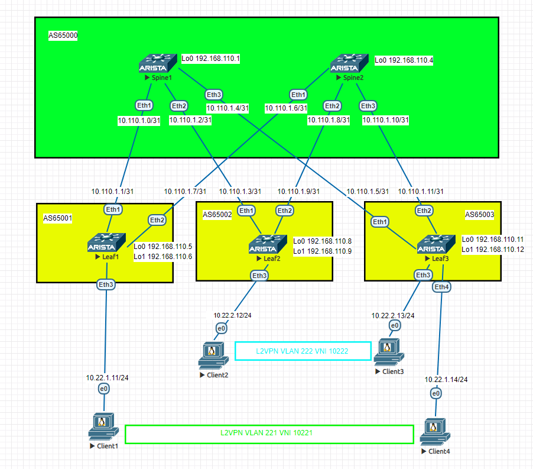
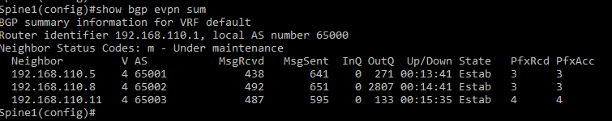
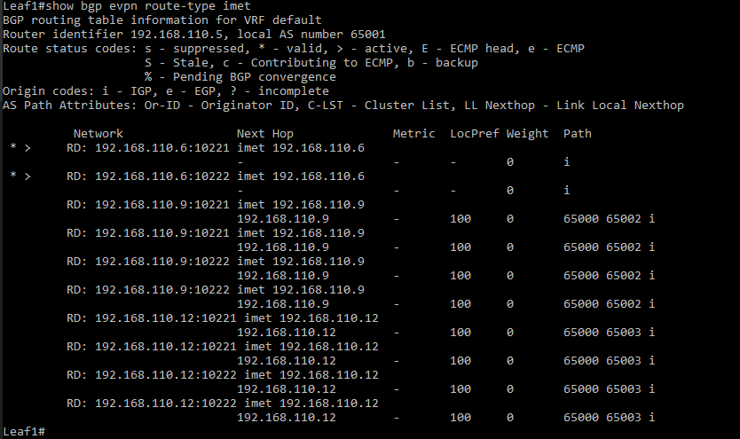
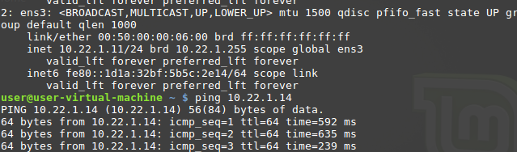
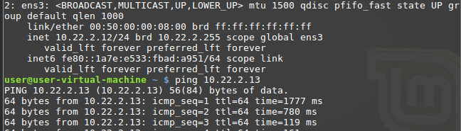

# Лаборная работа 5
## **VxLAN. 1**
## Цель:

* Настроить Overlay на основе VxLAN EVPN для L2 связанности между клиентами

 ## Решение:
 Работа будет выполнятся на коммутаторах Arista на базе схемы из [Лабораторной работы 4](../lab4/).
 В [Лабораторной работе 4](../lab4/) настроен Underlay на базе eBGP, используем эти настройки.

 **План работы**
 
 * Сформировать адресное пространство для Overlay сети и BGP
 * Собрать схему сети
 * Настроить коммутаторы
 * Настроить BGP peering между Leaf и Spine в AF l2vpn evpn
 * Настроена связанность между клиентами в первой зоне

 **Адресное пространство Underlay и Overlay сетей**

 Адреса p2p каналов:
|  Узел сети уровня Spine | порт| Адрес Spine    | Узел сети уровня Leaf | порт | Адрес Leaf     | Сеть           |
|---------|---|-------------|-----------|---------|---|----------------|
| Spine1 | Eth1   | 10.110.1.0  | Leaf1 |Eth1    | 10.110.1.1 | 10.110.1.0/31  |
| Spine1 | Eth2   | 10.110.1.2  | Leaf2 |Eth1    | 10.110.1.3 | 10.110.1.2/31  |
| Spine1 | Eth3   | 10.110.1.4  | Leaf3 |Eth1    | 10.110.1.5 | 10.110.1.4/31  |
| Spine2 | Eth1   | 10.110.1.6  | Leaf1 |Eth2    | 10.110.1.7 | 10.110.1.6/31  |
| Spine2 | Eth2   | 10.110.1.8  | Leaf2 |Eth2    | 10.110.1.9 | 10.110.1.8/31  |
| Spine2 | Eth3   | 10.110.1.10 | Leaf3 |Eth2   | 10.110.1.11| 10.110.1.10/31 |

Адреса клиентов:
| Клиент  | Адрес клиента     | Сеть         | VLAN ID | VNI |
|---------|------------|--------------|---------|------|
| Client1 | 10.22.1.11 | 10.22.1.0/24 | 221 | 10221 |
| Client2 | 10.22.2.12 | 10.22.1.0/24 | 222 | 10222 |
| Client3 | 10.22.2.13 | 10.22.1.0/24 | 222 | 10222 |
| Client4 | 10.22.1.14 | 10.22.1.0/24 | 221 | 10221 |

Адреса loopback интерфейсов:
| Узел сети | Адрес Lo0 | Адрес Lo1 |
|-----------|-----------|-----------|
| Spine1    |     192.168.110.1      | |
| Spine2    |     192.168.110.4      | |
| Leaf1    |      192.168.110.5     | 192.168.110.6 |
| Leaf2    |      192.168.110.8     | 192.168.110.9 |
| Leaf3    |      192.168.110.11     | 192.168.110.12 |

Номера AS
| Узел сети | NET |
|-----------|-----------|
| Spine    |     AS65000   |
| Leaf1    |      AS65001   |
| Leaf2    |      AS65002   |
| Leaf3    |      AS65003    |


 **Схема сети**
 
 

 **Настройка коммутаторов**

*Настройка протокола маршрутизации BGP для Overlay сети*
На каждом из Spine коммутаторов выполняем настройки BGP:
```
!Создаем группу LEAF_OVERLAY

(config-router-bgp)#neighbor LEAF_OVERLAY peer group

!Настраиваем BGP на использование адреса loopback в качестве next-hop для EBGP

(config-router-bgp)#neighbor LEAF_OVERLAY update-source Loopback0

!Задаем условия для динамического обнаружения соседей

(config-router-bgp)#bgp listen range 192.168.110.0/24 peer-group LEAF_OVERLAY peer-filter AS_FILTER

!Увеличиваем TTL чтобы свитчи могли устанавливать пиринг между loopback-интерфейсами

(config-router-bgp)#neighbor LEAF_OVERLAY ebgp-multihop 2

!Включаем send-community (включает standard и extended) для рассылки route target

(config-router-bgp)#neighbor LEAF_OVERLAY send-community

!Создаем address-family EVPN

(config-router-bgp)#address-family evpn

!Активируем peer-группу LEAF_OVERLAY в address-family EVPN

(config-router-bgp-af)#neighbor LEAF_OVERLAY activate

```

На каждом из Leaf коммутаторов выполняем настройки BGP:
```
!Добавляем Loopback1
(config)#interface Loopback 1
(config-if-Lo1)#ip address <IP Lo1 из таблицы>

!Аналогично spine настраиваем BGP на Leaf свитчах
(config-router-bgp)#neighbor SPINE_OVERLAY peer group
(config-router-bgp)#neighbor SPINE_OVERLAY remote-as 65000
(config-router-bgp)#neighbor SPINE_OVERLAY update-source Loopback0
(config-router-bgp)#neighbor SPINE_OVERLAY ebgp-multihop 2
(config-router-bgp)#neighbor SPINE_OVERLAY send-community
(config-router-bgp)#address-family evpn
(config-router-bgp)#neighbor SPINE_OVERLAY activate
address-family ipv4


!Добавляем в группу адреса loopback-интерфейсов spaine-свитчей

(config-router-bgp)#neighbor <IP-адрес интерфейса Lo0 на Spine1 подключенный к Leaf> peer group SPINE_OVERLAY
(config-router-bgp)#neighbor <IP-адрес интерфейса Lo0 на Spine2 подключенный к Leaf> peer group SPINE_OVERLAY

!Создаем vrf'ы для нужных vlan

(config-router-bgp)#vlan <VLAN ID из таблицы>

!Указываем route destinguisher (loopback:vni)

(config-macvrf-221)#rd <адрес Lo1>:<VNI из таблицы>

!и route target

(config-macvrf-221)#route-target both 1:<VNI из таблицы>

!Распределяем в VRF выученные ip адреса

(config-macvrf-221)#roredistribute learned

! Создаем VLAN`ы

(config)#VLAN <VLAN ID>,<VLAN ID>

!Создаем связку vlan:vni

!Создаем туннельный интерефйс Vxlan1

(config)#interface Vxlan1

!В качестве source interface указываем Lo1

(config-if-Vx1)#vxlan source-interface Loopback1

!Привязываем vlan к соответствующим vni

vxlan vlan <VLAN ID>,<VLAN ID> vni <VNI>,<VNI>

```

Для проверки связи между клиентами используем ```ping``` и команды на коммутаторах:
```
show bgp evpn sum
show bgp evpn route-type imet

!Так же для диганостики можно использовать различные команды, например
show bgp evpn route-type mac-ip
show vxlan address-table

```

В EVPN установилось соседство:





Клиенты видят друг друга:





<details>
<summary>Конфигурация Spine1</summary>
<pre><code>
! Command: show running-config
! device: Spine1 (vEOS-lab, EOS-4.26.4M)
!
! boot system flash:/vEOS-lab.swi
!
no aaa root
!
transceiver qsfp default-mode 4x10G
!
service routing protocols model multi-agent
!
hostname Spine1
!
spanning-tree mode mstp
!
interface Ethernet1
   no switchport
   ip address 10.110.1.0/31
!
interface Ethernet2
   no switchport
   ip address 10.110.1.2/31
!
interface Ethernet3
   no switchport
   ip address 10.110.1.4/31
!
interface Ethernet4
!
interface Ethernet5
!
interface Ethernet6
!
interface Ethernet7
!
interface Ethernet8
!
interface Loopback0
   ip address 192.168.110.1/32
!
interface Management1
!
ip routing
!
ip prefix-list LOOPBACKS seq 10 permit 192.168.110.0/24 le 32
!
route-map LOOPBACKS permit 10
   match ip address prefix-list LOOPBACKS
!
peer-filter AS_FILTER
   10 match as-range 65001-65999 result accept
!
router bgp 65000
   router-id 192.168.110.1
   maximum-paths 4
   bgp listen range 10.110.1.0/24 peer-group LEAFS_UNDERLAY peer-filter AS_FILTER
   bgp listen range 192.168.110.0/24 peer-group LEAF_OVERLAY peer-filter AS_FILTER
   neighbor LEAFS_UNDERLAY peer group
   neighbor LEAFS_UNDERLAY bfd
   neighbor LEAF_OVERLAY peer group
   neighbor LEAF_OVERLAY update-source Loopback0
   neighbor LEAF_OVERLAY ebgp-multihop 2
   neighbor LEAF_OVERLAY send-community
   redistribute connected route-map LOOPBACKS
   !
   address-family evpn
      neighbor LEAF_OVERLAY activate
   !
   address-family ipv4
      no neighbor LEAF_OVERLAY activate
!
end
</code></pre>
</details>

<details>
<summary>Конфигурация Spine2</summary>
<pre><code>
! Command: show running-config
! device: Spine2 (vEOS-lab, EOS-4.26.4M)
!
! boot system flash:/vEOS-lab.swi
!
no aaa root
!
transceiver qsfp default-mode 4x10G
!
service routing protocols model multi-agent
!
hostname Spine2
!
spanning-tree mode mstp
!
interface Ethernet1
   no switchport
   ip address 10.110.1.6/31
!
interface Ethernet2
   no switchport
   ip address 10.110.1.8/31
!
interface Ethernet3
   no switchport
   ip address 10.110.1.10/31
!
interface Ethernet4
!
interface Ethernet5
!
interface Ethernet6
!
interface Ethernet7
!
interface Ethernet8
!
interface Loopback0
   ip address 192.168.110.4/32
!
interface Management1
!
ip routing
!
ip prefix-list LOOPBACKS seq 10 permit 192.168.110.0/24 le 32
!
mpls ip
!
route-map LOOPBACKS permit 10
   match ip address prefix-list LOOPBACKS
!
peer-filter AS_FILTER
   10 match as-range 65001-65999 result accept
!
router bgp 65000
   router-id 192.168.110.4
   maximum-paths 4
   bgp listen range 10.110.1.0/24 peer-group LEAFS_UNDERLAY peer-filter AS_FILTER
   bgp listen range 192.168.110.0/24 peer-group LEAF_OVERLAY peer-filter AS_FILTER
   neighbor LEAFS_UNDERLAY peer group
   neighbor LEAFS_UNDERLAY bfd
   neighbor LEAF_OVERLAY peer group
   neighbor LEAF_OVERLAY update-source Loopback0
   neighbor LEAF_OVERLAY ebgp-multihop 2
   neighbor LEAF_OVERLAY send-community
   redistribute connected route-map LOOPBACKS
   !
   address-family evpn
      neighbor LEAF_OVERLAY activate
   !
   address-family ipv4
      no neighbor LEAF_OVERLAY activate
!
end
</code></pre>
</details>

<details>
<summary>Конфигурация Leaf1</summary>
<pre><code>
! Command: show running-config
! device: Leaf1 (vEOS-lab, EOS-4.26.4M)
!
! boot system flash:/vEOS-lab.swi
!
no aaa root
!
transceiver qsfp default-mode 4x10G
!
service routing protocols model multi-agent
!
hostname Leaf1
!
spanning-tree mode mstp
!
vlan 221-222
!
interface Ethernet1
   no switchport
   ip address 10.110.1.1/31
!
interface Ethernet2
   no switchport
   ip address 10.110.1.7/31
!
interface Ethernet3
   switchport access vlan 221
!
interface Ethernet4
!
interface Ethernet5
!
interface Ethernet6
!
interface Ethernet7
!
interface Ethernet8
!
interface Loopback0
   ip address 192.168.110.5/32
!
interface Loopback1
   ip address 192.168.110.6/32
!
interface Management1
!
interface Vxlan1
   vxlan source-interface Loopback1
   vxlan udp-port 4789
   vxlan vlan 221-222 vni 10221-10222
!
ip routing
!
ip prefix-list LOOPBACKS seq 10 permit 192.168.110.0/24 le 32
!
mpls ip
!
route-map LOOPBACKS permit 10
   match ip address prefix-list LOOPBACKS
!
router bgp 65001
   router-id 192.168.110.5
   maximum-paths 4
   neighbor SPINES_UNDERLAY peer group
   neighbor SPINES_UNDERLAY remote-as 65000
   neighbor SPINES_UNDERLAY bfd
   neighbor SPINE_OVERLAY peer group
   neighbor SPINE_OVERLAY remote-as 65000
   neighbor SPINE_OVERLAY update-source Loopback0
   neighbor SPINE_OVERLAY ebgp-multihop 2
   neighbor SPINE_OVERLAY send-community
   neighbor 10.110.1.0 peer group SPINES_UNDERLAY
   neighbor 10.110.1.6 peer group SPINES_UNDERLAY
   neighbor 192.168.110.1 peer group SPINE_OVERLAY
   neighbor 192.168.110.4 peer group SPINE_OVERLAY
   redistribute connected route-map LOOPBACKS
   !
   vlan 221
      rd 192.168.110.6:10221
      route-target both 1:10221
      redistribute learned
   !
   vlan 222
      rd 192.168.110.6:10222
      route-target both 1:10222
      redistribute learned
   !
   address-family evpn
      neighbor SPINE_OVERLAY activate
   !
   address-family ipv4
      no neighbor SPINE_OVERLAY activate
!
end
</code></pre>
</details>

<details>
<summary>Конфигурация Leaf2</summary>
<pre><code>
! Command: show running-config
! device: Leaf2 (vEOS-lab, EOS-4.26.4M)
!
! boot system flash:/vEOS-lab.swi
!
no aaa root
!
transceiver qsfp default-mode 4x10G
!
service routing protocols model multi-agent
!
hostname Leaf2
!
spanning-tree mode mstp
!
vlan 221-222
!
interface Ethernet1
   no switchport
   ip address 10.110.1.3/31
!
interface Ethernet2
   no switchport
   ip address 10.110.1.9/31
!
interface Ethernet3
   switchport access vlan 222
!
interface Ethernet4
!
interface Ethernet5
!
interface Ethernet6
!
interface Ethernet7
!
interface Ethernet8
!
interface Loopback0
   ip address 192.168.110.8/32
!
interface Loopback1
   ip address 192.168.110.9/32
!
interface Management1
!
interface Vxlan1
   vxlan source-interface Loopback1
   vxlan udp-port 4789
   vxlan vlan 221-222 vni 10221-10222
!
ip routing
!
ip prefix-list LOOPBACKS seq 10 permit 192.168.110.0/24 le 32
!
mpls ip
!
route-map LOOPBACKS permit 10
   match ip address prefix-list LOOPBACKS
!
router bgp 65002
   router-id 192.168.110.8
   maximum-paths 4
   neighbor SPINES_UNDERLAY peer group
   neighbor SPINES_UNDERLAY remote-as 65000
   neighbor SPINES_UNDERLAY bfd
   neighbor SPINE_OVERLAY peer group
   neighbor SPINE_OVERLAY remote-as 65000
   neighbor SPINE_OVERLAY update-source Loopback0
   neighbor SPINE_OVERLAY ebgp-multihop 2
   neighbor SPINE_OVERLAY send-community
   neighbor 10.110.1.2 peer group SPINES_UNDERLAY
   neighbor 10.110.1.8 peer group SPINES_UNDERLAY
   neighbor 192.168.110.1 peer group SPINE_OVERLAY
   neighbor 192.168.110.4 peer group SPINE_OVERLAY
   redistribute connected route-map LOOPBACKS
   !
   vlan 221
      rd 192.168.110.9:10221
      route-target both 1:10221
      redistribute learned
   !
   vlan 222
      rd 192.168.110.9:10222
      route-target both 1:10222
      redistribute learned
   !
   address-family evpn
      neighbor SPINE_OVERLAY activate
   !
   address-family ipv4
      no neighbor SPINE_OVERLAY activate
!
end
</code></pre>
</details>

<details>
<summary>Конфигурация Leaf3</summary>
<pre><code>
! Command: show running-config
! device: Leaf3 (vEOS-lab, EOS-4.26.4M)
!
! boot system flash:/vEOS-lab.swi
!
no aaa root
!
transceiver qsfp default-mode 4x10G
!
service routing protocols model multi-agent
!
hostname Leaf3
!
spanning-tree mode mstp
!
vlan 221-222
!
interface Ethernet1
   no switchport
   ip address 10.110.1.5/31
!
interface Ethernet2
   no switchport
   ip address 10.110.1.11/31
!
interface Ethernet3
   switchport access vlan 222
!
interface Ethernet4
   switchport access vlan 221
!
interface Ethernet5
!
interface Ethernet6
!
interface Ethernet7
!
interface Ethernet8
!
interface Loopback0
   ip address 192.168.110.11/32
!
interface Loopback1
   ip address 192.168.110.12/32
!
interface Management1
!
interface Vxlan1
   vxlan source-interface Loopback1
   vxlan udp-port 4789
   vxlan vlan 221-222 vni 10221-10222
!
ip routing
!
ip prefix-list LOOPBACKS seq 10 permit 192.168.110.0/24 le 32
!
mpls ip
!
route-map LOOPBACKS permit 10
   match ip address prefix-list LOOPBACKS
!
router bgp 65003
   router-id 192.168.110.11
   maximum-paths 4
   neighbor SPINES_UNDERLAY peer group
   neighbor SPINES_UNDERLAY remote-as 65000
   neighbor SPINES_UNDERLAY bfd
   neighbor SPINE_OVERLAY peer group
   neighbor SPINE_OVERLAY remote-as 65000
   neighbor SPINE_OVERLAY update-source Loopback0
   neighbor SPINE_OVERLAY ebgp-multihop 2
   neighbor SPINE_OVERLAY send-community
   neighbor 10.110.1.4 peer group SPINES_UNDERLAY
   neighbor 10.110.1.10 peer group SPINES_UNDERLAY
   neighbor 192.168.110.1 peer group SPINE_OVERLAY
   neighbor 192.168.110.4 peer group SPINE_OVERLAY
   redistribute connected route-map LOOPBACKS
   !
   vlan 221
      rd 192.168.110.12:10221
      route-target both 1:10221
      redistribute learned
   !
   vlan 222
      rd 192.168.110.12:10222
      route-target both 1:10222
      redistribute learned
   !
   address-family evpn
      neighbor SPINE_OVERLAY activate
   !
   address-family ipv4
      no neighbor SPINE_OVERLAY activate
!
end
</code></pre>
</details>
