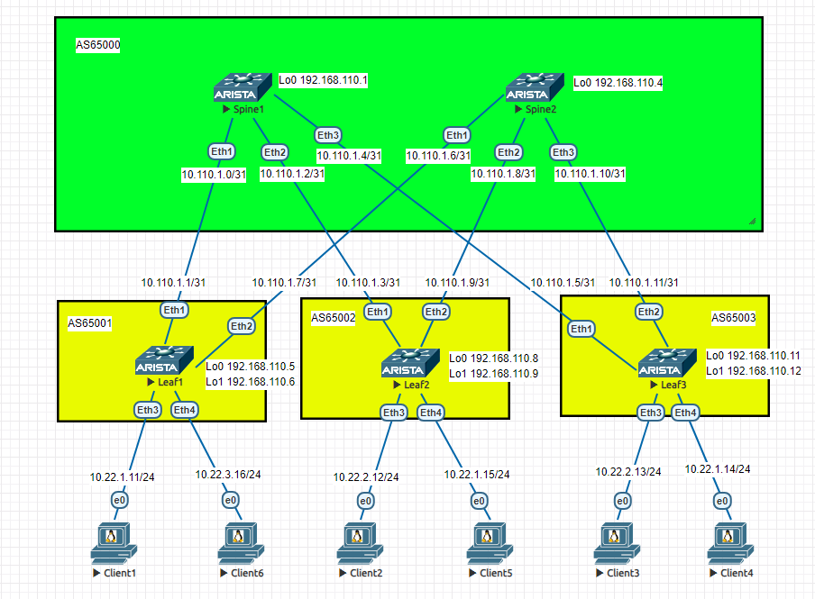
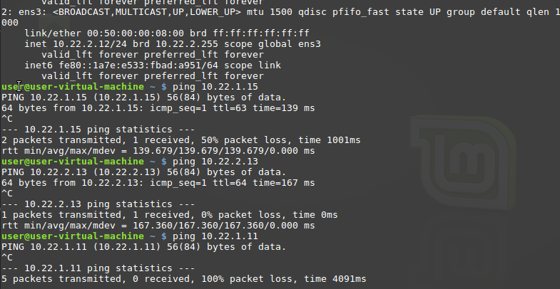
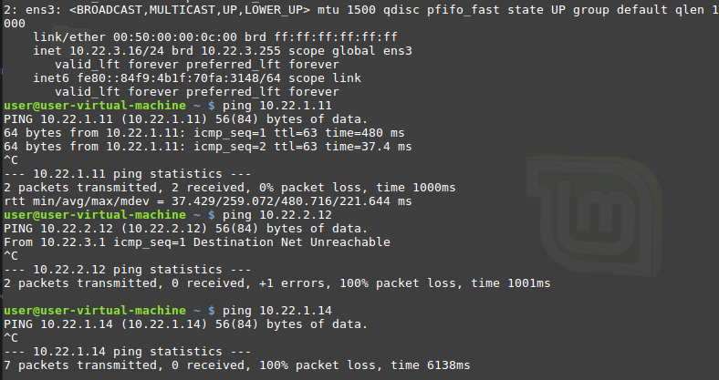
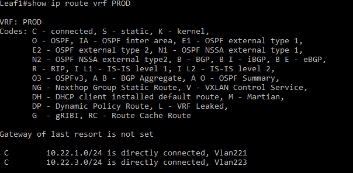
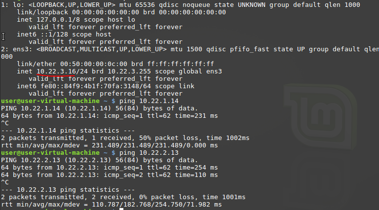
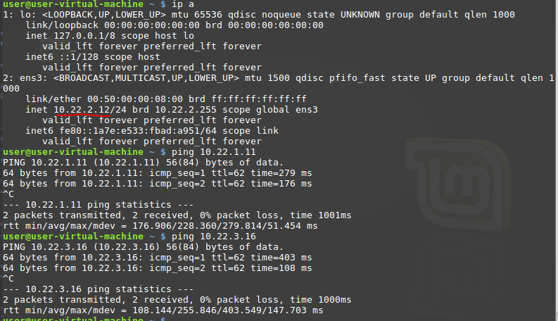
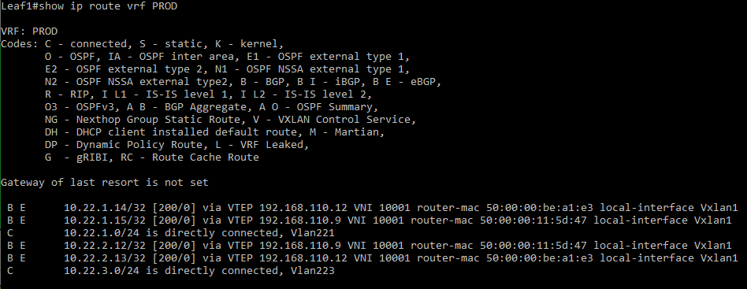

# Лаборная работа 6
## **VxLAN. 2**
## Цель:

* Настроить маршрутизацию в рамках Overlay между клиентами

 ## Решение:
 Работа будет выполнятся на коммутаторах Arista на базе схемы из [Лабораторной работы 5](../lab5/).
 В [Лабораторной работе 5](../lab5/) настроен Underlay и Overlay, используем эти настройки.

 **План работы**
 
 * Собрать схему сети
 * Настроить коммутаторы для Asymmetric IRB
 * Настроить коммутаторы для Symmetric IRB

 **Адресное пространство Underlay и Overlay сетей**

 Адреса p2p каналов:
|  Узел сети уровня Spine | порт| Адрес Spine    | Узел сети уровня Leaf | порт | Адрес Leaf     | Сеть           |
|---------|---|-------------|-----------|---------|---|----------------|
| Spine1 | Eth1   | 10.110.1.0  | Leaf1 |Eth1    | 10.110.1.1 | 10.110.1.0/31  |
| Spine1 | Eth2   | 10.110.1.2  | Leaf2 |Eth1    | 10.110.1.3 | 10.110.1.2/31  |
| Spine1 | Eth3   | 10.110.1.4  | Leaf3 |Eth1    | 10.110.1.5 | 10.110.1.4/31  |
| Spine2 | Eth1   | 10.110.1.6  | Leaf1 |Eth2    | 10.110.1.7 | 10.110.1.6/31  |
| Spine2 | Eth2   | 10.110.1.8  | Leaf2 |Eth2    | 10.110.1.9 | 10.110.1.8/31  |
| Spine2 | Eth3   | 10.110.1.10 | Leaf3 |Eth2   | 10.110.1.11| 10.110.1.10/31 |

Адреса клиентов:
| Клиент  | Адрес клиента     | Сеть         | VLAN ID | VNI |
|---------|------------|--------------|---------|------|
| Client1 | 10.22.1.11 | 10.22.1.0/24 | 221 | 10221 |
| Client2 | 10.22.2.12 | 10.22.1.0/24 | 222 | 10222 |
| Client3 | 10.22.2.13 | 10.22.1.0/24 | 222 | 10222 |
| Client4 | 10.22.1.14 | 10.22.1.0/24 | 221 | 10221 |
| Client5 | 10.22.1.15 | 10.22.1.0/24 | 221 | 10221 |
| Client6 | 10.23.1.16 | 10.22.1.0/24 | 221 | 10223 |

Адреса loopback интерфейсов:
| Узел сети | Адрес Lo0 | Адрес Lo1 |
|-----------|-----------|-----------|
| Spine1    |     192.168.110.1      | |
| Spine2    |     192.168.110.4      | |
| Leaf1    |      192.168.110.5     | 192.168.110.6 |
| Leaf2    |      192.168.110.8     | 192.168.110.9 |
| Leaf3    |      192.168.110.11     | 192.168.110.12 |

Номера AS
| Узел сети | NET |
|-----------|-----------|
| Spine    |     AS65000   |
| Leaf1    |      AS65001   |
| Leaf2    |      AS65002   |
| Leaf3    |      AS65003    |

Настройки VLAN

| VLAN ID | Сеть | Шлюз | VNI |
|---------|------|------|-----|
| 221 | 10.22.1.0/24 | 10.22.1.1 | 10221|
| 222 | 10.22.2.0/24 | 10.22.2.1 | 10222|
| 223 | 10.22.3.0/24 | 10.22.3.1 | 10223|


 **Схема сети**
 
 

 **Настройка коммутаторов**
 Настройки Spine не меняются.

 *Asymmetric IRB*
Настройки spine остаются без изменений

На каждом из Leaf коммутаторов выполняем настройки:
```
!Настройки на leaf выполняются для vlan используемых на этих lraf
!создаем vrf PROD
(config)#vrf instance PROD

!включаем маршрутизацию
(config)#ip routing vrf PROD

!создаем VLAN-интерфейс
(config)#interface Vlan<VLAN ID>

!добавляем в vrf PROD
(config-if-Vl221)#vrf PROD

!задаем виртуальный ip адрес для distributed gateway
(config-if-Vl221)#ip address virtual <ip адрес шлюза из таблицы>/<маска сети>

создаем виртуальный mac-адрес роутера, одинаковый на всех VTEP
(config)#ip virtual-router mac-address 00:00:22:22:33:33
```

Для проверки связи между клиентами используем ```ping``` и команду ```show ip route vrf PROD``` на коммутаторах.

Клиенты на Leaf2 и Leaf3 видят друг друга, т.к. VLAN этих клиентов настроены на этих Leaf:



Client6 подключенный к Leaf1 видит только Client1 так же подключенный к Leaf2, но не видит клиенты подключенные к другим Leaf.
Это происходит потому что VLAN 223 настроен только на Leaf1, но не настроен на Leaf2 и Leaf3



В таблице маршутизации vrf PROD коммутаторов есть только directly connetcted сети



В Asymmetric IRB необходимо настраивать все VLAN и соответствующие VNI на всех VTEP

*Symmetric IRB*

Настроим транзитный L3 VNI для vrf PROD. Это позволит не настраивать на всех Leaf все имеющиеся VLAN и VNI.

На каждом из Leaf коммутаторов выполняем настройки:
```
!Создаим L3 vni
(config)#interface Vxlan1
(config-if-Vx1)#vxlan vrf PROD vni 10001

!В процессе BGP создаем vfr PROD

(config)#router bgp <ASN>
vrf PROD

!Настраиваем RD
(config-router-bgp-vrf-PROD)#rd <IP Lo0>:10001

!Импорт и экспорт маршрутов EVPN
(config-router-bgp-vrf-PROD)#route-target import evpn 1:10001
(config-router-bgp-vrf-PROD)#route-target export evpn 1:10001
```

Теперь все клиенты видят друг друга:





В таблице маршрутизации появились маршруты




<details>
<summary>Конфигурация Spine1</summary>
<pre><code>
! Command: show running-config
! device: Spine1 (vEOS-lab, EOS-4.26.4M)
!
! boot system flash:/vEOS-lab.swi
!
no aaa root
!
transceiver qsfp default-mode 4x10G
!
service routing protocols model multi-agent
!
hostname Spine1
!
spanning-tree mode mstp
!
interface Ethernet1
   no switchport
   ip address 10.110.1.0/31
!
interface Ethernet2
   no switchport
   ip address 10.110.1.2/31
!
interface Ethernet3
   no switchport
   ip address 10.110.1.4/31
!
interface Ethernet4
!
interface Ethernet5
!
interface Ethernet6
!
interface Ethernet7
!
interface Ethernet8
!
interface Loopback0
   ip address 192.168.110.1/32
!
interface Management1
!
ip routing
!
ip prefix-list LOOPBACKS seq 10 permit 192.168.110.0/24 le 32
!
route-map LOOPBACKS permit 10
   match ip address prefix-list LOOPBACKS
!
peer-filter AS_FILTER
   10 match as-range 65001-65999 result accept
!
router bgp 65000
   router-id 192.168.110.1
   maximum-paths 4
   bgp listen range 10.110.1.0/24 peer-group LEAFS_UNDERLAY peer-filter AS_FILTER
   bgp listen range 192.168.110.0/24 peer-group LEAF_OVERLAY peer-filter AS_FILTER
   neighbor LEAFS_UNDERLAY peer group
   neighbor LEAF_OVERLAY peer group
   neighbor LEAF_OVERLAY update-source Loopback0
   neighbor LEAF_OVERLAY ebgp-multihop 2
   neighbor LEAF_OVERLAY send-community
   redistribute connected route-map LOOPBACKS
   !
   address-family evpn
      neighbor LEAF_OVERLAY activate
   !
   address-family ipv4
      no neighbor LEAF_OVERLAY activate
!
end
</code></pre>
</details>

<details>
<summary>Конфигурация Spine2</summary>
<pre><code>
! Command: show running-config
! device: Spine2 (vEOS-lab, EOS-4.26.4M)
!
! boot system flash:/vEOS-lab.swi
!
no aaa root
!
transceiver qsfp default-mode 4x10G
!
service routing protocols model multi-agent
!
hostname Spine2
!
spanning-tree mode mstp
!
interface Ethernet1
   no switchport
   ip address 10.110.1.6/31
!
interface Ethernet2
   no switchport
   ip address 10.110.1.8/31
!
interface Ethernet3
   no switchport
   ip address 10.110.1.10/31
!
interface Ethernet4
!
interface Ethernet5
!
interface Ethernet6
!
interface Ethernet7
!
interface Ethernet8
!
interface Loopback0
   ip address 192.168.110.4/32
!
interface Management1
!
ip routing
!
ip prefix-list LOOPBACKS seq 10 permit 192.168.110.0/24 le 32
!
mpls ip
!
route-map LOOPBACKS permit 10
   match ip address prefix-list LOOPBACKS
!
peer-filter AS_FILTER
   10 match as-range 65001-65999 result accept
!
router bgp 65000
   router-id 192.168.110.4
   maximum-paths 4
   bgp listen range 10.110.1.0/24 peer-group LEAFS_UNDERLAY peer-filter AS_FILTER
   bgp listen range 192.168.110.0/24 peer-group LEAF_OVERLAY peer-filter AS_FILTER
   neighbor LEAFS_UNDERLAY peer group
   neighbor LEAF_OVERLAY peer group
   neighbor LEAF_OVERLAY update-source Loopback0
   neighbor LEAF_OVERLAY ebgp-multihop 2
   neighbor LEAF_OVERLAY send-community
   redistribute connected route-map LOOPBACKS
   !
   address-family evpn
      neighbor LEAF_OVERLAY activate
   !
   address-family ipv4
      no neighbor LEAF_OVERLAY activate
!
</code></pre>
</details>

<details>
<summary>Конфигурация Leaf1</summary>
<pre><code>
! Command: show running-config
! device: Leaf1 (vEOS-lab, EOS-4.26.4M)
!
! boot system flash:/vEOS-lab.swi
!
no aaa root
!
transceiver qsfp default-mode 4x10G
!
service routing protocols model multi-agent
!
hostname Leaf1
!
spanning-tree mode mstp
!
vlan 221,223
!
vrf instance PROD
!
interface Ethernet1
   no switchport
   ip address 10.110.1.1/31
!
interface Ethernet2
   no switchport
   ip address 10.110.1.7/31
!
interface Ethernet3
   switchport access vlan 221
!
interface Ethernet4
   switchport access vlan 223
!
interface Ethernet5
!
interface Ethernet6
!
interface Ethernet7
!
interface Ethernet8
!
interface Loopback0
   ip address 192.168.110.5/32
!
interface Loopback1
   ip address 192.168.110.6/32
!
interface Management1
!
interface Vlan221
   vrf PROD
   ip address virtual 10.22.1.1/24
!
interface Vlan223
   vrf PROD
   ip address virtual 10.22.3.1/24
!
interface Vxlan1
   vxlan source-interface Loopback1
   vxlan udp-port 4789
   vxlan vlan 221-223 vni 10221-10223
   vxlan vrf PROD vni 10001
!
ip virtual-router mac-address 00:00:22:22:33:33
!
ip routing
ip routing vrf PROD
!
ip prefix-list LOOPBACKS seq 10 permit 192.168.110.0/24 le 32
!
mpls ip
!
route-map LOOPBACKS permit 10
   match ip address prefix-list LOOPBACKS
!
router bgp 65001
   router-id 192.168.110.5
   maximum-paths 2
   neighbor SPINES_UNDERLAY peer group
   neighbor SPINES_UNDERLAY remote-as 65000
   neighbor SPINES_UNDERLAY bfd
   neighbor SPINE_OVERLAY peer group
   neighbor SPINE_OVERLAY remote-as 65000
   neighbor SPINE_OVERLAY update-source Loopback0
   neighbor SPINE_OVERLAY ebgp-multihop 2
   neighbor SPINE_OVERLAY send-community
   neighbor 10.110.1.0 peer group SPINES_UNDERLAY
   neighbor 10.110.1.6 peer group SPINES_UNDERLAY
   neighbor 192.168.110.1 peer group SPINE_OVERLAY
   neighbor 192.168.110.4 peer group SPINE_OVERLAY
   redistribute connected route-map LOOPBACKS
   !
   vlan 221
      rd 192.168.110.6:10221
      route-target both 1:10221
      redistribute learned
   !
   vlan 223
      rd 192.168.110.6:10223
      route-target both 1:10223
      redistribute learned
   !
   address-family evpn
      neighbor SPINE_OVERLAY activate
   !
   address-family ipv4
      no neighbor SPINE_OVERLAY activate
   !
   vrf PROD
      rd 192.168.110.6:10001
      route-target import evpn 1:10001
      route-target export evpn 1:10001
!
</code></pre>
</details>

<details>
<summary>Конфигурация Leaf2</summary>
<pre><code>
! Command: show running-config
! device: Leaf2 (vEOS-lab, EOS-4.26.4M)
!
! boot system flash:/vEOS-lab.swi
!
no aaa root
!
transceiver qsfp default-mode 4x10G
!
service routing protocols model multi-agent
!
hostname Leaf2
!
spanning-tree mode mstp
!
vlan 221-222
!
vrf instance PROD
!
interface Ethernet1
   no switchport
   ip address 10.110.1.3/31
!
interface Ethernet2
   no switchport
   ip address 10.110.1.9/31
!
interface Ethernet3
   switchport access vlan 222
!
interface Ethernet4
   switchport access vlan 221
!
interface Ethernet5
!
interface Ethernet6
!
interface Ethernet7
!
interface Ethernet8
!
interface Loopback0
   ip address 192.168.110.8/32
!
interface Loopback1
   ip address 192.168.110.9/32
!
interface Management1
!
interface Vlan221
   vrf PROD
   ip address virtual 10.22.1.1/24
!
interface Vlan222
   vrf PROD
   ip address virtual 10.22.2.1/24
!
interface Vxlan1
   vxlan source-interface Loopback1
   vxlan udp-port 4789
   vxlan vlan 221-223 vni 10221-10223
   vxlan vrf PROD vni 10001
!
ip virtual-router mac-address 00:00:22:22:33:33
!
ip routing
ip routing vrf PROD
!
ip prefix-list LOOPBACKS seq 10 permit 192.168.110.0/24 le 32
!
mpls ip
!
route-map LOOPBACKS permit 10
   match ip address prefix-list LOOPBACKS
!
router bgp 65002
   router-id 192.168.110.8
   maximum-paths 2
   neighbor SPINES_UNDERLAY peer group
   neighbor SPINES_UNDERLAY remote-as 65000
   neighbor SPINES_UNDERLAY bfd
   neighbor SPINE_OVERLAY peer group
   neighbor SPINE_OVERLAY remote-as 65000
   neighbor SPINE_OVERLAY update-source Loopback0
   neighbor SPINE_OVERLAY ebgp-multihop 2
   neighbor SPINE_OVERLAY send-community
   neighbor 10.110.1.2 peer group SPINES_UNDERLAY
   neighbor 10.110.1.8 peer group SPINES_UNDERLAY
   neighbor 192.168.110.1 peer group SPINE_OVERLAY
   neighbor 192.168.110.4 peer group SPINE_OVERLAY
   redistribute connected route-map LOOPBACKS
   !
   vlan 221
      rd 192.168.110.9:10221
      route-target both 1:10221
      redistribute learned
   !
   vlan 222
      rd 192.168.110.9:10222
      route-target both 1:10222
      redistribute learned
   !
   address-family evpn
      neighbor SPINE_OVERLAY activate
   !
   address-family ipv4
      no neighbor SPINE_OVERLAY activate
   !
   vrf PROD
      rd 192.168.110.9:10001
      route-target import evpn 1:10001
      route-target export evpn 1:10001
!
end
</code></pre>
</details>

<details>
<summary>Конфигурация Leaf3</summary>
<pre><code>
! Command: show running-config
! device: Leaf3 (vEOS-lab, EOS-4.26.4M)
!
! boot system flash:/vEOS-lab.swi
!
no aaa root
!
transceiver qsfp default-mode 4x10G
!
service routing protocols model multi-agent
!
hostname Leaf3
!
spanning-tree mode mstp
!
vlan 221-222
!
vrf instance PROD
!
interface Ethernet1
   no switchport
   ip address 10.110.1.5/31
!
interface Ethernet2
   no switchport
   ip address 10.110.1.11/31
!
interface Ethernet3
   switchport access vlan 222
!
interface Ethernet4
   switchport access vlan 221
!
interface Ethernet5
!
interface Ethernet6
!
interface Ethernet7
!
interface Ethernet8
!
interface Loopback0
   ip address 192.168.110.11/32
!
interface Loopback1
   ip address 192.168.110.12/32
!
interface Management1
!
interface Vlan221
   vrf PROD
   ip address virtual 10.22.1.1/24
!
interface Vlan222
   vrf PROD
   ip address virtual 10.22.2.1/24
!
interface Vxlan1
   vxlan source-interface Loopback1
   vxlan udp-port 4789
   vxlan vlan 221-223 vni 10221-10223
   vxlan vrf PROD vni 10001
!
ip virtual-router mac-address 00:00:22:22:33:33
!
ip routing
ip routing vrf PROD
!
ip prefix-list LOOPBACKS seq 10 permit 192.168.110.0/24 le 32
!
mpls ip
!
route-map LOOPBACKS permit 10
   match ip address prefix-list LOOPBACKS
!
router bgp 65003
   router-id 192.168.110.11
   maximum-paths 2
   neighbor SPINES_UNDERLAY peer group
   neighbor SPINES_UNDERLAY remote-as 65000
   neighbor SPINES_UNDERLAY bfd
   neighbor SPINE_OVERLAY peer group
   neighbor SPINE_OVERLAY remote-as 65000
   neighbor SPINE_OVERLAY update-source Loopback0
   neighbor SPINE_OVERLAY ebgp-multihop 2
   neighbor SPINE_OVERLAY send-community
   neighbor 10.110.1.4 peer group SPINES_UNDERLAY
   neighbor 10.110.1.10 peer group SPINES_UNDERLAY
   neighbor 192.168.110.1 peer group SPINE_OVERLAY
   neighbor 192.168.110.4 peer group SPINE_OVERLAY
   redistribute connected route-map LOOPBACKS
   !
   vlan 221
      rd 192.168.110.12:10221
      route-target both 1:10221
      redistribute learned
   !
   vlan 222
      rd 192.168.110.12:10222
      route-target both 1:10222
      redistribute learned
   !
   address-family evpn
      neighbor SPINE_OVERLAY activate
   !
   address-family ipv4
      no neighbor SPINE_OVERLAY activate
   !
   vrf PROD
      rd 192.168.110.12:10001
      route-target import evpn 1:10001
      route-target export evpn 1:10001
!
end
</code></pre>
</details>

