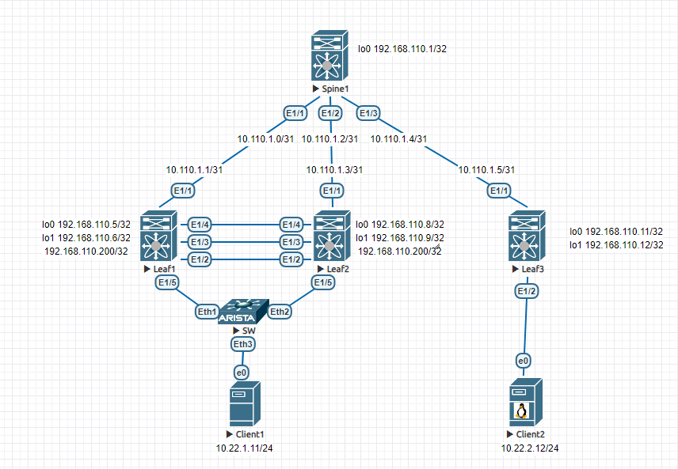
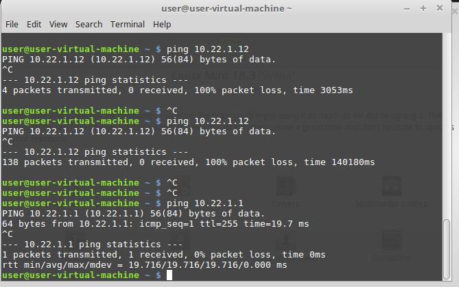
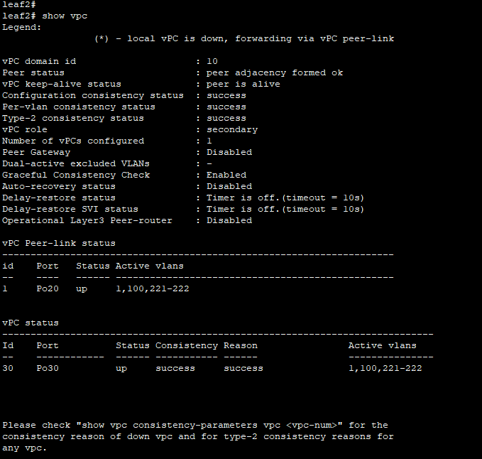
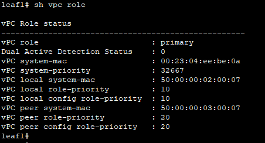
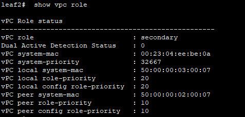

# Лаборная работа 6
## **VxLAN. 3**
## Цель:

* Настроить отказоустойчивое подключение клиентов с использованием VPC

 ## Решение:
 Работа будет выполнятся на коммутаторах Cisco.
 Настройки Underlay и Overlay и EVPN с симметричным IRB будут выполнены по аналогии с [Лабораторной работой 6](../lab6/).

 **План работы**
 
 * Собрать схему сети
 * Подключить клиентов двумя линками к различным Leaf
 * Настроите агрегированный канал со стороны клиента
 * Настроите VPC для работы в Overlay сети

 **Адресное пространство Underlay и Overlay сетей**

 Адреса p2p каналов:
|  Узел сети уровня Spine | порт| Адрес Spine    | Узел сети уровня Leaf | порт | Адрес Leaf     | Сеть           |
|---------|---|-------------|-----------|---------|---|----------------|
| Spine1 | Eth1/1  | 10.110.1.0  | Leaf1 |Eth1/1  | 10.110.1.1 | 10.110.1.0/31  |
| Spine1 | Eth1/2   | 10.110.1.2  | Leaf2 |Eth1/1   | 10.110.1.3 | 10.110.1.2/31  |
| Spine1 | Eth1/3   | 10.110.1.4  | Leaf3 |Eth1/1  | 10.110.1.5 | 10.110.1.4/31  |

Адреса клиентов:
| Клиент  | Адрес клиента     | Сеть         | VLAN ID | VNI |
|---------|------------|--------------|---------|------|
| Client1 | 10.22.1.11 | 10.22.1.0/24 | 221 | 10221 |
| Client2 | 10.22.2.12 | 10.22.1.0/24 | 222 | 10222 |


Адреса loopback интерфейсов:
| Узел сети | Адрес Lo0 | Адрес Lo1 | Lo1 secondary |
|-----------|-----------|-----------|---|
| Spine1    |     192.168.110.1      | |
| Leaf1    |      192.168.110.5     | 192.168.110.6 | 192.168.110.200 |
| Leaf2    |      192.168.110.8     | 192.168.110.9 | 192.168.110.200|
| Leaf3    |      192.168.110.11     | 192.168.110.12 | |

keep-alive link
| Узел | Порт | Адрес |
|------|------|-------|
| Leaf1 | Eth1/4 | 10.1.1.0/31 |
| Leaf2 | Eth1/4 | 10.1.1.1/31 |

 **Схема сети**
 
 

 **Настройка VPC**

```
! На leaf1 и leaf2
! Создаем vrf keepalive

vrf context keepalive

! Настраиваем интерфейс для keepalive

interface Ethernet1/4
no switchport
vrf member keepalive
ip address <IP-адрес из таблицы>
no shutdown

! Создаем vpc

vpc domain 10

! Задаем приоритет, чем меньше число, тем выше приоритет

role priority <число, на одном из свитчей больше, чем на другом>

! Указываем адрес для проверки доступности второго узла
peer-keepalive destination <IP Eth1/4 второго свитча> source <IP Eth1/4 свичта на котром проводим настройку> vrf keepalive

! Настраиваем оба vPC узла в качестве root bridge для Spanning Tree

peer-switch

! Включаем задержку восстановления после сбоя

delay restore 10

! Настраиваем Peer Link для передачи управляющего трафика

interface ethernet 1/2-3
no shutdown
channel-group 20 mode active

! Настраиваем port channel используемый для Peer Link

interface port-channel 20
no shutdown
switchport mode trunk
vpc peer-link

! Настраиваем агрегированный интерфейс на двух свитчах для подключения клиента
! В качстве клиента используем свитч SW с настроенным link aggregation и подключенным к свитчу компьютером

interface port-channel30
switchport mode trunk
vpc 30

interface Ethernet1/5
switchport mode trunk
channel-group 30 mode active

```
Для проверки используем команды

```
! на коммутаторах
show vpc
show vpc role

! на клиентах
ping

```

Клиенты видят друг друга:



vPC включен и работает:



На leaf1 и leaf2 одинаковый system mac





<details>
<summary>Конфигурация Spine1</summary>
<pre><code>
!Command: show running-config
!Running configuration last done at: Tue Sep 12 17:31:16 2023
!Time: Tue Sep 12 18:20:34 2023

version 9.2(2) Bios:version
switchname spine1
vdc spine1 id 1
  limit-resource vlan minimum 16 maximum 4094
  limit-resource vrf minimum 2 maximum 4096
  limit-resource port-channel minimum 0 maximum 511
  limit-resource u4route-mem minimum 248 maximum 248
  limit-resource u6route-mem minimum 96 maximum 96
  limit-resource m4route-mem minimum 58 maximum 58
  limit-resource m6route-mem minimum 8 maximum 8

no feature ssh
feature telnet
cfs eth distribute
nv overlay evpn
feature bgp
feature fabric forwarding
feature interface-vlan
feature vn-segment-vlan-based
feature nv overlay

no password strength-check
username admin password 5 $5$HGKFII$ynhW3AhV/xGJ7b9ZyS.8t1zQx2PKwTRg6ypjlUVW0m9
 role network-admin
ip domain-lookup
copp profile strict
snmp-server user admin network-admin auth md5 0x60fb4ae284b0f0f0511c95429ee54d0b
 priv 0x60fb4ae284b0f0f0511c95429ee54d0b localizedkey
rmon event 1 description FATAL(1) owner PMON@FATAL
rmon event 2 description CRITICAL(2) owner PMON@CRITICAL
rmon event 3 description ERROR(3) owner PMON@ERROR
rmon event 4 description WARNING(4) owner PMON@WARNING
rmon event 5 description INFORMATION(5) owner PMON@INFO

vlan 1

route-map RM-LOOPBACK permit 10
  match interface loopback0
route-map RM-NHU permit 10
  set ip next-hop unchanged
vrf context management


interface Vlan1

interface Ethernet1/1
  no switchport
  mtu 9216
  ip address 10.110.1.0/31
  no shutdown

interface Ethernet1/2
  no switchport
  mtu 9216
  ip address 10.110.1.2/31
  no shutdown

interface Ethernet1/3
  no switchport
  mtu 9216
  ip address 10.110.1.4/31
  no shutdown

interface Ethernet1/4

interface Ethernet1/5

interface Ethernet1/6

interface Ethernet1/7

interface Ethernet1/8

interface Ethernet1/9

interface Ethernet1/10

interface Ethernet1/11

interface Ethernet1/12

interface Ethernet1/13

interface Ethernet1/14

interface Ethernet1/15

interface Ethernet1/16

interface Ethernet1/17

interface Ethernet1/18

interface Ethernet1/19

interface Ethernet1/20

interface Ethernet1/21

interface Ethernet1/22

interface Ethernet1/23

interface Ethernet1/24

interface Ethernet1/25

interface Ethernet1/26

interface Ethernet1/27

interface Ethernet1/28

interface Ethernet1/29

interface Ethernet1/30

interface Ethernet1/31

interface Ethernet1/32

interface Ethernet1/33

interface Ethernet1/34

interface Ethernet1/35

interface Ethernet1/36

interface Ethernet1/37

interface Ethernet1/38

interface Ethernet1/39

interface Ethernet1/40

interface Ethernet1/41

interface Ethernet1/42

interface Ethernet1/43

interface Ethernet1/44

interface Ethernet1/45

interface Ethernet1/46

interface Ethernet1/47

interface Ethernet1/48

interface Ethernet1/49

interface Ethernet1/50

interface Ethernet1/51

interface Ethernet1/52

interface Ethernet1/53

interface Ethernet1/54

interface Ethernet1/55

interface Ethernet1/56

interface Ethernet1/57

interface Ethernet1/58

interface Ethernet1/59

interface Ethernet1/60

interface Ethernet1/61

interface Ethernet1/62

interface Ethernet1/63

interface Ethernet1/64

interface Ethernet1/65

interface Ethernet1/66

interface Ethernet1/67

interface Ethernet1/68

interface Ethernet1/69

interface Ethernet1/70

interface Ethernet1/71

interface Ethernet1/72

interface Ethernet1/73

interface Ethernet1/74

interface Ethernet1/75

interface Ethernet1/76

interface Ethernet1/77

interface Ethernet1/78

interface Ethernet1/79

interface Ethernet1/80

interface Ethernet1/81

interface Ethernet1/82

interface Ethernet1/83

interface Ethernet1/84

interface Ethernet1/85

interface Ethernet1/86

interface Ethernet1/87

interface Ethernet1/88

interface Ethernet1/89

interface Ethernet1/90

interface Ethernet1/91

interface Ethernet1/92

interface Ethernet1/93

interface Ethernet1/94

interface Ethernet1/95

interface Ethernet1/96

interface Ethernet1/97

interface Ethernet1/98

interface Ethernet1/99

interface Ethernet1/100

interface Ethernet1/101

interface Ethernet1/102

interface Ethernet1/103

interface Ethernet1/104

interface Ethernet1/105

interface Ethernet1/106

interface Ethernet1/107

interface Ethernet1/108

interface Ethernet1/109

interface Ethernet1/110

interface Ethernet1/111

interface Ethernet1/112

interface Ethernet1/113

interface Ethernet1/114

interface Ethernet1/115

interface Ethernet1/116

interface Ethernet1/117

interface Ethernet1/118

interface Ethernet1/119

interface Ethernet1/120

interface Ethernet1/121

interface Ethernet1/122

interface Ethernet1/123

interface Ethernet1/124

interface Ethernet1/125

interface Ethernet1/126

interface Ethernet1/127

interface Ethernet1/128

interface mgmt0
  vrf member management

interface loopback0
  ip address 192.168.110.1/32
line console
line vty
boot nxos bootflash:/nxos.9.2.2.bin
router bgp 65000
  router-id 192.168.110.1
  address-family ipv4 unicast
    redistribute direct route-map RM-LOOPBACK
  address-family l2vpn evpn
    retain route-target all
  neighbor 10.110.1.1
    remote-as 65001
    address-family ipv4 unicast
  neighbor 10.110.1.3
    remote-as 65002
    address-family ipv4 unicast
  neighbor 10.110.1.5
    remote-as 65003
    address-family ipv4 unicast
  neighbor 192.168.110.5
    remote-as 65001
    update-source loopback0
    ebgp-multihop 2
    address-family l2vpn evpn
      send-community
      send-community extended
      route-map RM-NHU out
  neighbor 192.168.110.8
    remote-as 65002
    update-source loopback0
    ebgp-multihop 2
    address-family l2vpn evpn
      send-community
      send-community extended
      route-map RM-NHU out
  neighbor 192.168.110.11
    remote-as 65003
    update-source loopback0
    ebgp-multihop 2
    address-family l2vpn evpn
      send-community
      send-community extended
      route-map RM-NHU out

</code></pre>
</details>

<details>
<summary>Конфигурация Leaf1</summary>
<pre><code>
!Command: show running-config
!Running configuration last done at: Tue Sep 12 18:16:53 2023
!Time: Tue Sep 12 18:17:38 2023

version 9.2(2) Bios:version
switchname leaf1
vdc leaf1 id 1
  limit-resource vlan minimum 16 maximum 4094
  limit-resource vrf minimum 2 maximum 4096
  limit-resource port-channel minimum 0 maximum 511
  limit-resource u4route-mem minimum 248 maximum 248
  limit-resource u6route-mem minimum 96 maximum 96
  limit-resource m4route-mem minimum 58 maximum 58
  limit-resource m6route-mem minimum 8 maximum 8

no feature ssh
feature telnet
cfs eth distribute
nv overlay evpn
feature bgp
feature fabric forwarding
feature interface-vlan
feature vn-segment-vlan-based
feature lacp
feature vpc
feature nv overlay

no password strength-check
username admin password 5 $5$JMMFHA$My4Bz5GeOH2h9iaj9Xyq.QjGf8eXyiqPC5g2Ja25rj0
 role network-admin
ip domain-lookup
copp profile strict
snmp-server user admin network-admin auth md5 0x842513228c8296cb56d32aa77c5c91ed
 priv 0x842513228c8296cb56d32aa77c5c91ed localizedkey
rmon event 1 description FATAL(1) owner PMON@FATAL
rmon event 2 description CRITICAL(2) owner PMON@CRITICAL
rmon event 3 description ERROR(3) owner PMON@ERROR
rmon event 4 description WARNING(4) owner PMON@WARNING
rmon event 5 description INFORMATION(5) owner PMON@INFO

fabric forwarding anycast-gateway-mac 0000.0000.0001
vlan 1,100,221-222
vlan 100
  vn-segment 10100
vlan 221
  vn-segment 10221
vlan 222
  vn-segment 10222

route-map RM-LOOPBACK permit 10
  match interface loopback0 loopback1
vrf context TEST
  vni 10100
  rd 192.168.110.5:100
  address-family ipv4 unicast
    route-target import 100:100
    route-target import 100:100 evpn
    route-target export 100:100
    route-target export 100:100 evpn
vrf context keepalive
vrf context management
vpc domain 10
  peer-switch
  role priority 10
  peer-keepalive destination 10.1.1.1 source 10.1.1.0 vrf keepalive
  delay restore 10
  ip arp synchronize


interface Vlan1

interface Vlan100
  no shutdown
  vrf member TEST
  ip forward

interface Vlan221
  no shutdown
  vrf member TEST
  ip address 10.22.1.1/24
  fabric forwarding mode anycast-gateway

interface Vlan222
  no shutdown
  vrf member TEST
  ip address 10.22.2.1/24
  fabric forwarding mode anycast-gateway

interface port-channel20
  switchport mode trunk
  spanning-tree port type network
  vpc peer-link

interface port-channel30
  switchport mode trunk
  vpc 30

interface nve1
  no shutdown
  host-reachability protocol bgp
  source-interface loopback1
  global ingress-replication protocol bgp
  member vni 10100 associate-vrf
  member vni 10221
  member vni 10222

interface Ethernet1/1
  no switchport
  mtu 9216
  ip address 10.110.1.1/31
  no shutdown

interface Ethernet1/2
  switchport mode trunk
  channel-group 20 mode active

interface Ethernet1/3
  switchport mode trunk
  channel-group 20 mode active

interface Ethernet1/4
  no switchport
  vrf member keepalive
  ip address 10.1.1.0/31
  no shutdown

interface Ethernet1/5
  switchport mode trunk
  channel-group 30 mode active

interface Ethernet1/6

interface Ethernet1/7

interface Ethernet1/8

interface Ethernet1/9

interface Ethernet1/10

interface Ethernet1/11

interface Ethernet1/12

interface Ethernet1/13

interface Ethernet1/14

interface Ethernet1/15

interface Ethernet1/16

interface Ethernet1/17

interface Ethernet1/18

interface Ethernet1/19

interface Ethernet1/20

interface Ethernet1/21

interface Ethernet1/22

interface Ethernet1/23

interface Ethernet1/24

interface Ethernet1/25

interface Ethernet1/26

interface Ethernet1/27

interface Ethernet1/28

interface Ethernet1/29

interface Ethernet1/30

interface Ethernet1/31

interface Ethernet1/32

interface Ethernet1/33

interface Ethernet1/34

interface Ethernet1/35

interface Ethernet1/36

interface Ethernet1/37

interface Ethernet1/38

interface Ethernet1/39

interface Ethernet1/40

interface Ethernet1/41

interface Ethernet1/42

interface Ethernet1/43

interface Ethernet1/44

interface Ethernet1/45

interface Ethernet1/46

interface Ethernet1/47

interface Ethernet1/48

interface Ethernet1/49

interface Ethernet1/50

interface Ethernet1/51

interface Ethernet1/52

interface Ethernet1/53

interface Ethernet1/54

interface Ethernet1/55

interface Ethernet1/56

interface Ethernet1/57

interface Ethernet1/58

interface Ethernet1/59

interface Ethernet1/60

interface Ethernet1/61

interface Ethernet1/62

interface Ethernet1/63

interface Ethernet1/64

interface Ethernet1/65

interface Ethernet1/66

interface Ethernet1/67

interface Ethernet1/68

interface Ethernet1/69

interface Ethernet1/70

interface Ethernet1/71

interface Ethernet1/72

interface Ethernet1/73

interface Ethernet1/74

interface Ethernet1/75

interface Ethernet1/76

interface Ethernet1/77

interface Ethernet1/78

interface Ethernet1/79

interface Ethernet1/80

interface Ethernet1/81

interface Ethernet1/82

interface Ethernet1/83

interface Ethernet1/84

interface Ethernet1/85

interface Ethernet1/86

interface Ethernet1/87

interface Ethernet1/88

interface Ethernet1/89

interface Ethernet1/90

interface Ethernet1/91

interface Ethernet1/92

interface Ethernet1/93

interface Ethernet1/94

interface Ethernet1/95

interface Ethernet1/96

interface Ethernet1/97

interface Ethernet1/98

interface Ethernet1/99

interface Ethernet1/100

interface Ethernet1/101

interface Ethernet1/102

interface Ethernet1/103

interface Ethernet1/104

interface Ethernet1/105

interface Ethernet1/106

interface Ethernet1/107

interface Ethernet1/108

interface Ethernet1/109

interface Ethernet1/110

interface Ethernet1/111

interface Ethernet1/112

interface Ethernet1/113

interface Ethernet1/114

interface Ethernet1/115

interface Ethernet1/116

interface Ethernet1/117

interface Ethernet1/118

interface Ethernet1/119

interface Ethernet1/120

interface Ethernet1/121

interface Ethernet1/122

interface Ethernet1/123

interface Ethernet1/124

interface Ethernet1/125

interface Ethernet1/126

interface Ethernet1/127

interface Ethernet1/128

interface mgmt0
  vrf member management

interface loopback0
  ip address 192.168.110.5/32

interface loopback1
  ip address 192.168.110.6/32
  ip address 192.168.110.200/32 secondary
line console
line vty
boot nxos bootflash:/nxos.9.2.2.bin
router bgp 65001
  router-id 192.168.110.5
  address-family ipv4 unicast
    redistribute direct route-map RM-LOOPBACK
  neighbor 10.110.1.0
    remote-as 65000
    address-family ipv4 unicast
  neighbor 192.168.110.1
    remote-as 65000
    update-source loopback0
    ebgp-multihop 2
    address-family l2vpn evpn
      send-community
      send-community extended
evpn
  vni 10221 l2
    rd 192.168.110.5:10221
    route-target import auto
    route-target export auto
  vni 10222 l2
    rd 192.168.110.5:10222
    route-target import auto
    route-target export auto

</code></pre>
</details>

<details>
<summary>Конфигурация Leaf2</summary>
<pre><code>
!Command: show running-config
!Running configuration last done at: Tue Sep 12 18:16:49 2023
!Time: Tue Sep 12 18:24:20 2023

version 9.2(2) Bios:version
switchname leaf2
vdc leaf2 id 1
  limit-resource vlan minimum 16 maximum 4094
  limit-resource vrf minimum 2 maximum 4096
  limit-resource port-channel minimum 0 maximum 511
  limit-resource u4route-mem minimum 248 maximum 248
  limit-resource u6route-mem minimum 96 maximum 96
  limit-resource m4route-mem minimum 58 maximum 58
  limit-resource m6route-mem minimum 8 maximum 8

no feature ssh
feature telnet
cfs eth distribute
nv overlay evpn
feature bgp
feature fabric forwarding
feature interface-vlan
feature vn-segment-vlan-based
feature lacp
feature vpc
feature nv overlay

no password strength-check
username admin password 5 $5$JNLMCK$TuS9LxzhIYQmDqOwodvuSq2kEWtOYttF89AQ8nl.GTA
 role network-admin
ip domain-lookup
copp profile strict
snmp-server user admin network-admin auth md5 0xa0592966a86174abd3d57ff712f93617
 priv 0xa0592966a86174abd3d57ff712f93617 localizedkey
rmon event 1 description FATAL(1) owner PMON@FATAL
rmon event 2 description CRITICAL(2) owner PMON@CRITICAL
rmon event 3 description ERROR(3) owner PMON@ERROR
rmon event 4 description WARNING(4) owner PMON@WARNING
rmon event 5 description INFORMATION(5) owner PMON@INFO

fabric forwarding anycast-gateway-mac 0000.0000.0001
vlan 1,100,221-222
vlan 100
  vn-segment 10100
vlan 221
  vn-segment 10221
vlan 222
  vn-segment 10222

route-map RM-LOOPBACK permit 10
  match interface loopback0 loopback1
vrf context TEST
  vni 10100
  rd 192.168.110.8:100
  address-family ipv4 unicast
    route-target import 100:100
    route-target import 100:100 evpn
    route-target export 100:100
    route-target export 100:100 evpn
vrf context keepalive
vrf context management
vpc domain 10
  peer-switch
  role priority 20
  peer-keepalive destination 10.1.1.0 source 10.1.1.1 vrf keepalive
  delay restore 10
  ip arp synchronize


interface Vlan1

interface Vlan100
  no shutdown
  vrf member TEST
  ip forward

interface Vlan221
  no shutdown
  vrf member TEST
  ip address 10.22.1.1/24
  fabric forwarding mode anycast-gateway

interface Vlan222
  no shutdown
  vrf member TEST
  ip address 10.22.2.1/24
  fabric forwarding mode anycast-gateway

interface port-channel20
  switchport mode trunk
  spanning-tree port type network
  vpc peer-link

interface port-channel30
  switchport mode trunk
  vpc 30

interface nve1
  no shutdown
  host-reachability protocol bgp
  source-interface loopback1
  global ingress-replication protocol bgp
  member vni 10100 associate-vrf
  member vni 10221
  member vni 10222

interface Ethernet1/1
  no switchport
  mtu 9216
  ip address 10.110.1.3/31
  no shutdown

interface Ethernet1/2
  switchport mode trunk
  channel-group 20 mode active

interface Ethernet1/3
  switchport mode trunk
  channel-group 20 mode active

interface Ethernet1/4
  no switchport
  vrf member keepalive
  ip address 10.1.1.1/31
  no shutdown

interface Ethernet1/5
  switchport mode trunk
  channel-group 30 mode active

interface Ethernet1/6

interface Ethernet1/7

interface Ethernet1/8

interface Ethernet1/9

interface Ethernet1/10

interface Ethernet1/11

interface Ethernet1/12

interface Ethernet1/13

interface Ethernet1/14

interface Ethernet1/15

interface Ethernet1/16

interface Ethernet1/17

interface Ethernet1/18

interface Ethernet1/19

interface Ethernet1/20

interface Ethernet1/21

interface Ethernet1/22

interface Ethernet1/23

interface Ethernet1/24

interface Ethernet1/25

interface Ethernet1/26

interface Ethernet1/27

interface Ethernet1/28

interface Ethernet1/29

interface Ethernet1/30

interface Ethernet1/31

interface Ethernet1/32

interface Ethernet1/33

interface Ethernet1/34

interface Ethernet1/35

interface Ethernet1/36

interface Ethernet1/37

interface Ethernet1/38

interface Ethernet1/39

interface Ethernet1/40

interface Ethernet1/41

interface Ethernet1/42

interface Ethernet1/43

interface Ethernet1/44

interface Ethernet1/45

interface Ethernet1/46

interface Ethernet1/47

interface Ethernet1/48

interface Ethernet1/49

interface Ethernet1/50

interface Ethernet1/51

interface Ethernet1/52

interface Ethernet1/53

interface Ethernet1/54

interface Ethernet1/55

interface Ethernet1/56

interface Ethernet1/57

interface Ethernet1/58

interface Ethernet1/59

interface Ethernet1/60

interface Ethernet1/61

interface Ethernet1/62

interface Ethernet1/63

interface Ethernet1/64

interface Ethernet1/65

interface Ethernet1/66

interface Ethernet1/67

interface Ethernet1/68

interface Ethernet1/69

interface Ethernet1/70

interface Ethernet1/71

interface Ethernet1/72

interface Ethernet1/73

interface Ethernet1/74

interface Ethernet1/75

interface Ethernet1/76

interface Ethernet1/77

interface Ethernet1/78

interface Ethernet1/79

interface Ethernet1/80

interface Ethernet1/81

interface Ethernet1/82

interface Ethernet1/83

interface Ethernet1/84

interface Ethernet1/85

interface Ethernet1/86

interface Ethernet1/87

interface Ethernet1/88

interface Ethernet1/89

interface Ethernet1/90

interface Ethernet1/91

interface Ethernet1/92

interface Ethernet1/93

interface Ethernet1/94

interface Ethernet1/95

interface Ethernet1/96

interface Ethernet1/97

interface Ethernet1/98

interface Ethernet1/99

interface Ethernet1/100

interface Ethernet1/101

interface Ethernet1/102

interface Ethernet1/103

interface Ethernet1/104

interface Ethernet1/105

interface Ethernet1/106

interface Ethernet1/107

interface Ethernet1/108

interface Ethernet1/109

interface Ethernet1/110

interface Ethernet1/111

interface Ethernet1/112

interface Ethernet1/113

interface Ethernet1/114

interface Ethernet1/115

interface Ethernet1/116

interface Ethernet1/117

interface Ethernet1/118

interface Ethernet1/119

interface Ethernet1/120

interface Ethernet1/121

interface Ethernet1/122

interface Ethernet1/123

interface Ethernet1/124

interface Ethernet1/125

interface Ethernet1/126

interface Ethernet1/127

interface Ethernet1/128

interface mgmt0
  vrf member management

interface loopback0
  ip address 192.168.110.8/32

interface loopback1
  ip address 192.168.110.9/32
  ip address 192.168.110.200/32 secondary
line console
line vty
boot nxos bootflash:/nxos.9.2.2.bin
router bgp 65002
  router-id 192.168.110.8
  address-family ipv4 unicast
    redistribute direct route-map RM-LOOPBACK
  neighbor 10.110.1.2
    remote-as 65000
    address-family ipv4 unicast
  neighbor 192.168.110.1
    remote-as 65000
    update-source loopback0
    ebgp-multihop 2
    address-family l2vpn evpn
      send-community
      send-community extended
evpn
  vni 10221 l2
    rd 192.168.110.8:10221
    route-target import auto
    route-target export auto
  vni 10222 l2
    rd 192.168.110.8:10222
    route-target import auto
    route-target export auto


</code></pre>
</details>

<details>
<summary>Конфигурация Leaf3</summary>
<pre><code>
!Command: show running-config
!Running configuration last done at: Tue Sep 12 18:16:46 2023
!Time: Tue Sep 12 18:25:08 2023

version 9.2(2) Bios:version
switchname leaf3
vdc leaf3 id 1
  limit-resource vlan minimum 16 maximum 4094
  limit-resource vrf minimum 2 maximum 4096
  limit-resource port-channel minimum 0 maximum 511
  limit-resource u4route-mem minimum 248 maximum 248
  limit-resource u6route-mem minimum 96 maximum 96
  limit-resource m4route-mem minimum 58 maximum 58
  limit-resource m6route-mem minimum 8 maximum 8

no feature ssh
feature telnet
cfs eth distribute
nv overlay evpn
feature bgp
feature fabric forwarding
feature interface-vlan
feature vn-segment-vlan-based
feature lacp
feature vpc
feature nv overlay

no password strength-check
username admin password 5 $5$JAFHHH$5fKp0x0cSJlQzVMYbWDYwl83ISIzURrkYVHO6IYfoc8
 role network-admin
ip domain-lookup
copp profile strict
snmp-server user admin network-admin auth md5 0xa95c3aac410ecd2e60cd349a21f666e8
 priv 0xa95c3aac410ecd2e60cd349a21f666e8 localizedkey
rmon event 1 description FATAL(1) owner PMON@FATAL
rmon event 2 description CRITICAL(2) owner PMON@CRITICAL
rmon event 3 description ERROR(3) owner PMON@ERROR
rmon event 4 description WARNING(4) owner PMON@WARNING
rmon event 5 description INFORMATION(5) owner PMON@INFO

fabric forwarding anycast-gateway-mac 0000.0000.0001
vlan 1,100,221-222
vlan 100
  vn-segment 10100
vlan 221
  vn-segment 10221
vlan 222
  vn-segment 10222

route-map RM-LOOPBACK permit 10
  match interface loopback0 loopback1
vrf context TEST
  vni 10100
  rd 192.168.110.11:100
  address-family ipv4 unicast
    route-target import 100:100
    route-target import 100:100 evpn
    route-target export 100:100
    route-target export 100:100 evpn
vrf context management


interface Vlan1

interface Vlan100
  no shutdown
  vrf member TEST
  ip forward

interface Vlan221
  no shutdown
  vrf member TEST
  ip address 10.22.1.1/24
  fabric forwarding mode anycast-gateway

interface Vlan222
  no shutdown
  vrf member TEST
  ip address 10.22.2.1/24
  fabric forwarding mode anycast-gateway

interface nve1
  no shutdown
  host-reachability protocol bgp
  source-interface loopback1
  global ingress-replication protocol bgp
  member vni 10100 associate-vrf
  member vni 10221
  member vni 10222

interface Ethernet1/1
  no switchport
  mtu 9216
  ip address 10.110.1.5/31
  no shutdown

interface Ethernet1/2
  switchport access vlan 222

interface Ethernet1/3

interface Ethernet1/4

interface Ethernet1/5

interface Ethernet1/6

interface Ethernet1/7

interface Ethernet1/8

interface Ethernet1/9

interface Ethernet1/10

interface Ethernet1/11

interface Ethernet1/12

interface Ethernet1/13

interface Ethernet1/14

interface Ethernet1/15

interface Ethernet1/16

interface Ethernet1/17

interface Ethernet1/18

interface Ethernet1/19

interface Ethernet1/20

interface Ethernet1/21

interface Ethernet1/22

interface Ethernet1/23

interface Ethernet1/24

interface Ethernet1/25

interface Ethernet1/26

interface Ethernet1/27

interface Ethernet1/28

interface Ethernet1/29

interface Ethernet1/30

interface Ethernet1/31

interface Ethernet1/32

interface Ethernet1/33

interface Ethernet1/34

interface Ethernet1/35

interface Ethernet1/36

interface Ethernet1/37

interface Ethernet1/38

interface Ethernet1/39

interface Ethernet1/40

interface Ethernet1/41

interface Ethernet1/42

interface Ethernet1/43

interface Ethernet1/44

interface Ethernet1/45

interface Ethernet1/46

interface Ethernet1/47

interface Ethernet1/48

interface Ethernet1/49

interface Ethernet1/50

interface Ethernet1/51

interface Ethernet1/52

interface Ethernet1/53

interface Ethernet1/54

interface Ethernet1/55

interface Ethernet1/56

interface Ethernet1/57

interface Ethernet1/58

interface Ethernet1/59

interface Ethernet1/60

interface Ethernet1/61

interface Ethernet1/62

interface Ethernet1/63

interface Ethernet1/64

interface Ethernet1/65

interface Ethernet1/66

interface Ethernet1/67

interface Ethernet1/68

interface Ethernet1/69

interface Ethernet1/70

interface Ethernet1/71

interface Ethernet1/72

interface Ethernet1/73

interface Ethernet1/74

interface Ethernet1/75

interface Ethernet1/76

interface Ethernet1/77

interface Ethernet1/78

interface Ethernet1/79

interface Ethernet1/80

interface Ethernet1/81

interface Ethernet1/82

interface Ethernet1/83

interface Ethernet1/84

interface Ethernet1/85

interface Ethernet1/86

interface Ethernet1/87

interface Ethernet1/88

interface Ethernet1/89

interface Ethernet1/90

interface Ethernet1/91

interface Ethernet1/92

interface Ethernet1/93

interface Ethernet1/94

interface Ethernet1/95

interface Ethernet1/96

interface Ethernet1/97

interface Ethernet1/98

interface Ethernet1/99

interface Ethernet1/100

interface Ethernet1/101

interface Ethernet1/102

interface Ethernet1/103

interface Ethernet1/104

interface Ethernet1/105

interface Ethernet1/106

interface Ethernet1/107

interface Ethernet1/108

interface Ethernet1/109

interface Ethernet1/110

interface Ethernet1/111

interface Ethernet1/112

interface Ethernet1/113

interface Ethernet1/114

interface Ethernet1/115

interface Ethernet1/116

interface Ethernet1/117

interface Ethernet1/118

interface Ethernet1/119

interface Ethernet1/120

interface Ethernet1/121

interface Ethernet1/122

interface Ethernet1/123

interface Ethernet1/124

interface Ethernet1/125

interface Ethernet1/126

interface Ethernet1/127

interface Ethernet1/128

interface mgmt0
  vrf member management

interface loopback0
  ip address 192.168.110.11/32

interface loopback1
  ip address 192.168.110.12/32
line console
line vty
boot nxos bootflash:/nxos.9.2.2.bin
router bgp 65003
  router-id 192.168.110.11
  address-family ipv4 unicast
    redistribute direct route-map RM-LOOPBACK
  neighbor 10.110.1.4
    remote-as 65000
    address-family ipv4 unicast
  neighbor 192.168.110.1
    remote-as 65000
    update-source loopback0
    ebgp-multihop 2
    address-family l2vpn evpn
      send-community
      send-community extended
evpn
  vni 10221 l2
    rd 192.168.110.11:10221
    route-target import auto
    route-target export auto
  vni 10222 l2
    rd 192.168.110.11:10222
    route-target import auto
    route-target export auto


</code></pre>
</details>

<details>
<summary>Настройка SW</summary>
<pre><code>
! Command: show running-config
! device: SW (vEOS-lab, EOS-4.26.4M)
!
! boot system flash:/vEOS-lab.swi
!
no aaa root
!
transceiver qsfp default-mode 4x10G
!
service routing protocols model multi-agent
!
hostname SW
!
spanning-tree mode mstp
!
vlan 221
!
interface Port-Channel30
   switchport mode trunk
!
interface Ethernet1
   channel-group 30 mode active
!
interface Ethernet2
   channel-group 30 mode active
!
interface Ethernet3
   switchport access vlan 221
!
interface Ethernet4
!
interface Ethernet5
!
interface Ethernet6
!
interface Ethernet7
!
interface Ethernet8
!
interface Management1
!
no ip routing
!
end

</code></pre>
</details>

