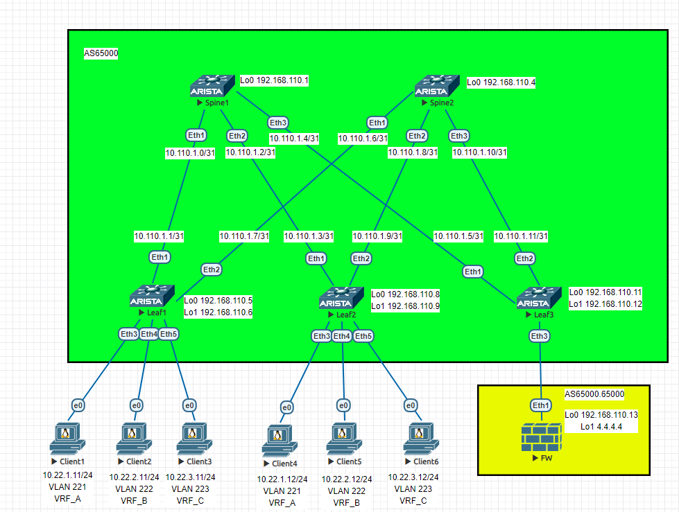
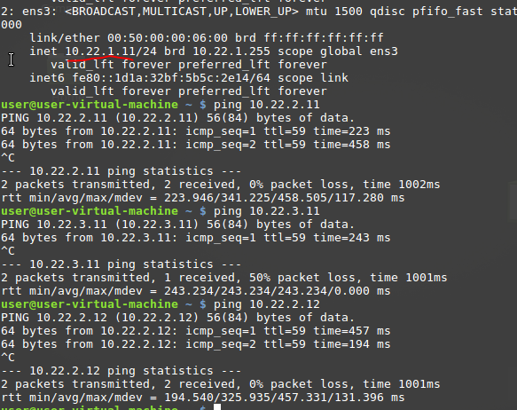
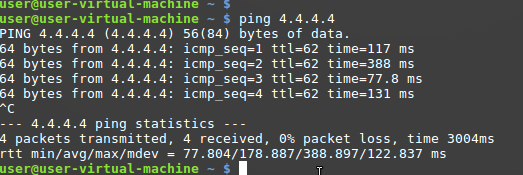
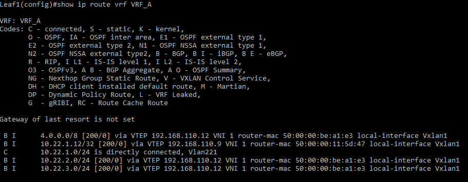

# Лаборная работа 8
## **VxLAN. 4**
## Цель:

* Реализовать передачу суммарных префиксов через EVPN route-type 5

 ## Решение:
 Работа будет выполнятся на коммутаторах Arista на базе схемы из [Лабораторной работы 6](../lab6/).
 Будем использовать три VRF и внешний маршрутизатор.
 Leaf3 будет выполнять роль borderleaf
 Внешняя сеть будет эмулироваться адресом 4.4.4.4 на интерфейсе Lo1 внешнего маршрутизатора


 **План работы**
 
 * Собрать схему сети
 * Настроить iBGP и добавить требуемые настройки для VRF
 * Настроить внешний маршрутизатор
 * Реализовать передачу суммарных префиксов

 **Адресное пространство Underlay и Overlay сетей**

 Адреса p2p каналов:
|  Узел сети уровня Spine | порт| Адрес Spine    | Узел сети уровня Leaf | порт | Адрес Leaf     | Сеть           |
|---------|---|-------------|-----------|---------|---|----------------|
| Spine1 | Eth1   | 10.110.1.0  | Leaf1 |Eth1    | 10.110.1.1 | 10.110.1.0/31  |
| Spine1 | Eth2   | 10.110.1.2  | Leaf2 |Eth1    | 10.110.1.3 | 10.110.1.2/31  |
| Spine1 | Eth3   | 10.110.1.4  | Leaf3 |Eth1    | 10.110.1.5 | 10.110.1.4/31  |
| Spine2 | Eth1   | 10.110.1.6  | Leaf1 |Eth2    | 10.110.1.7 | 10.110.1.6/31  |
| Spine2 | Eth2   | 10.110.1.8  | Leaf2 |Eth2    | 10.110.1.9 | 10.110.1.8/31  |
| Spine2 | Eth3   | 10.110.1.10 | Leaf3 |Eth2   | 10.110.1.11| 10.110.1.10/31 |

Адреса клиентов:
| Клиент  | Адрес клиента     | Сеть  | VLAN ID | VNI | VRF |
|---------|------------|--------------|---------|------|---|
| Client1 | 10.22.1.11 | 10.22.1.0/24 | 221 | 10221 |  A |
| Client2 | 10.22.2.11 | 10.22.2.0/24 | 222 | 10222 |  B |
| Client3 | 10.22.3.11 | 10.22.3.0/24 | 223 | 10223 |  C |
| Client4 | 10.22.1.12 | 10.22.1.0/24 | 221 | 10221 |  A |
| Client5 | 10.22.2.12 | 10.22.2.0/24 | 223 | 10222 |  B |
| Client6 | 10.23.3.12 | 10.22.3.0/24 | 223 | 10223 |  C |

Адреса loopback интерфейсов:
| Узел сети | Адрес Lo0 | Адрес Lo1 |
|-----------|-----------|-----------|
| Spine1    |     192.168.110.1      | |
| Spine2    |     192.168.110.4      | |
| Leaf1    |      192.168.110.5     | 192.168.110.6 |
| Leaf2    |      192.168.110.8     | 192.168.110.9 |
| Leaf3    |      192.168.110.11     | 192.168.110.12 |
| FW    |      192.168.110.13     | 4.4.4.4 |


Номера AS
| Узел сети | NET |
|-----------|-----------|
| Spine    |     AS65000   |
| Leaf1    |      AS65000   |
| Leaf2    |      AS65000   |
| Leaf3    |      AS65000    |
| FW    |      AS65000.65000    |

Настройки VLAN

| VLAN ID | Сеть | Шлюз | VNI | VRF | ID |
|---------|------|------|-----| --- |---|
| 221 | 10.22.1.0/24 | 10.22.1.1 | 10221| VRF_A | 10001 |
| 222 | 10.22.2.0/24 | 10.22.2.1 | 10222| VRF_B | 10002 |
| 223 | 10.22.3.0/24 | 10.22.3.1 | 10223| VRF_C | 10003 |


 **Схема сети**
 
 

 **Настроить iBGP**
 
 Настройки Spine

```
peer-filter AS_FILTER
   10 match as-range 65000-65999 result accept

router bgp 65000
   router-id <IP адрес Lo1>
   maximum-paths 4
   bgp listen range 10.110.1.0/24 peer-group LEAFS_UNDERLAY peer-filter AS_FILTER
   bgp listen range 192.168.110.0/24 peer-group LEAF_OVERLAY peer-filter AS_FILTER
   neighbor LEAFS_UNDERLAY peer group
   neighbor LEAFS_UNDERLAY next-hop-self
   neighbor LEAFS_UNDERLAY route-reflector-client
   neighbor LEAF_OVERLAY peer group
   neighbor LEAF_OVERLAY update-source Loopback0
   neighbor LEAF_OVERLAY route-reflector-client
   neighbor LEAF_OVERLAY send-community
   redistribute connected route-map LOOPBACKS
   !
   address-family evpn
      neighbor LEAF_OVERLAY activate
   !
   address-family ipv4
      no neighbor LEAF_OVERLAY activate

```
Настройки Leaf

```
! Добавим VLAN`ы, VRF и включим маршрутизацию

vlan 221, 222, 223
vrf instance <VRF>
interface Vlan <VLAN ID>
   vrf <VRF>
   ip address virtual <шлюз>
ip routing vrf <VRF>

!Настроим VXLAN
interface Vxlan1
   vxlan source-interface Loopback1
   vxlan udp-port 4789
   vxlan vlan 221-223 vni 10221-10223
   vxlan vrf VRF_A vni 1
   vxlan vrf VRF_B vni 2
   vxlan vrf VRF_C vni 3

! Настроим bgp
router bgp 65000
   router-id <IP Lo0>
   maximum-paths 2
   neighbor SPINES_UNDERLAY peer group
   neighbor SPINES_UNDERLAY remote-as 65000
   neighbor SPINE_OVERLAY peer group
   neighbor SPINE_OVERLAY remote-as 65000
   neighbor SPINE_OVERLAY update-source Loopback0
   neighbor SPINE_OVERLAY send-community
   neighbor 10.110.1.4 peer group SPINES_UNDERLAY
   neighbor 10.110.1.10 peer group SPINES_UNDERLAY
   neighbor 192.168.110.1 peer group SPINE_OVERLAY
   neighbor 192.168.110.4 peer group SPINE_OVERLAY
   redistribute connected route-map LOOPBACKS
   !
   vlan <VLAN ID>
      rd <IP Lo0>:<VNI>
      route-target both 1:<VNI>
      redistribute learned
   
   address-family evpn
      neighbor SPINE_OVERLAY activate
   !
   address-family ipv4
      no neighbor SPINE_OVERLAY activate
   !
   vrf <VRF>
      rd <IP Lo0>:<ID>
      route-target import evpn 1:<ID>
      route-target export evpn 1:<ID>

```
**Настроить внешний маршрутизатор и передача суммарных префиксов**

Адреса интерфейсов для подключения borderleaf (leaf3) к FW
| порт Leaf3 | Адрес        | порт FW | Адрес       | Сеть           |
|------------|--------------|---------|-------------|----------------|
| Eth3.1     | 10.110.1.12  | Eth1.1  | 10.110.1.13 | 10.110.1.12/31 |
| Eth3.2     | 10.110.1.14  | Eth1.2  | 10.110.1.15 | 10.110.1.14/31 |
| Eth3.3     | 10.110.1.16  | Eth1.3  | 10.110.1.17 | 10.110.1.16/31 |

Настройки FW
```
! Настроим интерфейсы
interface Ethernet1.1
   encapsulation dot1q vlan <VLAN ID>
   ip address <IP из таблицы>

! Настроим loopback интерфейсы
interface Loopback0
   ip address <IP из таблицы>
! Адрес 4.4.4.4 будет эмулировать внешнюю сеть
interface Loopback1
   ip address 4.4.4.4/32

!Настроим route-map для частного диапазона сетей
ip prefix-list PRIVATE seq 10 permit 10.0.0.0/8 le 32
ip prefix-list PRIVATE seq 20 permit 192.168.0.0/16 le 32
ip prefix-list PRIVATE seq 30 permit 172.16.0.0/12 le 32
ip prefix-list PRIVATE seq 40 permit 198.18.0.0/15 le 32
route-map INTERNET deny 10
   match ip address prefix-list PRIVATE
route-map INTERNET permit 20

!Настроим BGP

router bgp 65000.65000
   router-id <IP Lo0>
   neighbor 10.110.1.12 remote-as 65000.65001
   neighbor 10.110.1.14 remote-as 65000.65002
   neighbor 10.110.1.16 remote-as 65000.65003
 !Передадим суммарный префикс 4.0.0.0/8
   aggregate-address 4.0.0.0/8 summary-only
   redistribute connected route-map INTERNET


```
Настройки Leaf3
```
!Настроим интерфейс которым свитч будет подключен к внешнему маршрутизатору
interface Ethernet3.1
   encapsulation dot1q vlan <VLAN ID>
   ip address <IP из таблицы>
!Настроим VXLAN
interface Vxlan1
   vxlan source-interface Loopback1
   vxlan udp-port 4789
   vxlan vrf VRF_A vni 1
   vxlan vrf VRF_B vni 2
   vxlan vrf VRF_C vni 3

! Настроим суммарный префикс используемых подсетей и подсетей Loopback`ов
ip prefix-list LOOPBACKS seq 10 permit 192.168.110.0/24 le 32
ip prefix-list PROD seq 10 permit 10.22.0.0/16 le 32

!Настроим BGP
router bgp 65000
   router-id <адрес Lo0>
   neighbor SPINES_UNDERLAY peer group
   neighbor SPINES_UNDERLAY remote-as 65000
   neighbor SPINE_OVERLAY peer group
   neighbor SPINE_OVERLAY remote-as 65000
   neighbor SPINE_OVERLAY update-source Loopback0
   neighbor SPINE_OVERLAY send-community
   neighbor 10.110.1.4 peer group SPINES_UNDERLAY
   neighbor 10.110.1.10 peer group SPINES_UNDERLAY
   neighbor 192.168.110.1 peer group SPINE_OVERLAY
   neighbor 192.168.110.4 peer group SPINE_OVERLAY
   redistribute connected route-map LOOPBACKS
   !
   address-family evpn
      neighbor SPINE_OVERLAY activate
   !
   address-family ipv4
      no neighbor SPINE_OVERLAY activate
   !
   vrf <VRF>
      rd <IP Lo0>:<ID>
      route-target import evpn 1:<ID>
      route-target export evpn 1:<ID>
      neighbor <IP адрес соответсвющего интерфейса FW> remote-as 65000.65000
      neighbor <IP адрес соответсвющего интерфейса FW> local-as 65000.<соответсвует настойке на стороне FW> no-prepend replace-as
      aggregate-address <Сеть соответствующего VLAN> summary-only
      redistribute connected route-map PROD
```

Для проверки используем ```ping``` и команду ```show ip route vrf ``` на коммутаторах.

Клиенты видят друг друга и видят адрес, эмулирующий внешнюю сеть.





В таблице маршутизации vrf коммутаторов есть сети всех VLAN



<details>
<summary>Конфигурация Spine1</summary>
<pre><code>
! Command: show running-config
! device: Spine1 (vEOS-lab, EOS-4.26.4M)
!
! boot system flash:/vEOS-lab.swi
!
no aaa root
!
transceiver qsfp default-mode 4x10G
!
service routing protocols model multi-agent
!
hostname Spine1
!
spanning-tree mode mstp
!
interface Ethernet1
   no switchport
   ip address 10.110.1.0/31
!
interface Ethernet2
   no switchport
   ip address 10.110.1.2/31
!
interface Ethernet3
   no switchport
   ip address 10.110.1.4/31
!
interface Ethernet4
!
interface Ethernet5
!
interface Ethernet6
!
interface Ethernet7
!
interface Ethernet8
!
interface Loopback0
   ip address 192.168.110.1/32
!
interface Management1
!
ip routing
!
ip prefix-list LOOPBACKS seq 10 permit 192.168.110.0/24 le 32
!
route-map LOOPBACKS permit 10
   match ip address prefix-list LOOPBACKS
!
peer-filter AS_FILTER
   20 match as-range 65000-65999 result accept
!
router bgp 65000
   router-id 192.168.110.1
   maximum-paths 4
   bgp listen range 10.110.1.0/24 peer-group LEAFS_UNDERLAY peer-filter AS_FILTER
   bgp listen range 192.168.110.0/24 peer-group LEAF_OVERLAY peer-filter AS_FILTER
   neighbor LEAFS_UNDERLAY peer group
   neighbor LEAFS_UNDERLAY next-hop-self
   neighbor LEAFS_UNDERLAY route-reflector-client
   neighbor LEAF_OVERLAY peer group
   neighbor LEAF_OVERLAY update-source Loopback0
   neighbor LEAF_OVERLAY route-reflector-client
   neighbor LEAF_OVERLAY send-community
   redistribute connected route-map LOOPBACKS
   !
   address-family evpn
      neighbor LEAF_OVERLAY activate
   !
   address-family ipv4
      no neighbor LEAF_OVERLAY activate
!
end
</code></pre>
</details>

<details>
<summary>Конфигурация Spine2</summary>
<pre><code>
! Command: show running-config
! device: Spine2 (vEOS-lab, EOS-4.26.4M)
!
! boot system flash:/vEOS-lab.swi
!
no aaa root
!
transceiver qsfp default-mode 4x10G
!
service routing protocols model multi-agent
!
hostname Spine2
!
spanning-tree mode mstp
!
interface Ethernet1
   no switchport
   ip address 10.110.1.6/31
!
interface Ethernet2
   no switchport
   ip address 10.110.1.8/31
!
interface Ethernet3
   no switchport
   ip address 10.110.1.10/31
!
interface Ethernet4
!
interface Ethernet5
!
interface Ethernet6
!
interface Ethernet7
!
interface Ethernet8
!
interface Loopback0
   ip address 192.168.110.4/32
!
interface Management1
!
ip routing
!
ip prefix-list LOOPBACKS seq 10 permit 192.168.110.0/24 le 32
!
mpls ip
!
route-map LOOPBACKS permit 10
   match ip address prefix-list LOOPBACKS
!
peer-filter AS_FILTER
   10 match as-range 65000-65999 result accept
!
router bgp 65000
   router-id 192.168.110.4
   maximum-paths 4
   bgp listen range 10.110.1.0/24 peer-group LEAFS_UNDERLAY peer-filter AS_FILTER
   bgp listen range 192.168.110.0/24 peer-group LEAF_OVERLAY peer-filter AS_FILTER
   neighbor LEAFS_UNDERLAY peer group
   neighbor LEAFS_UNDERLAY next-hop-self
   neighbor LEAFS_UNDERLAY route-reflector-client
   neighbor LEAF_OVERLAY peer group
   neighbor LEAF_OVERLAY update-source Loopback0
   neighbor LEAF_OVERLAY route-reflector-client
   neighbor LEAF_OVERLAY send-community
   redistribute connected route-map LOOPBACKS
   !
   address-family evpn
      neighbor LEAF_OVERLAY activate
   !
   address-family ipv4
      no neighbor LEAF_OVERLAY activate
!
</code></pre>
</details>

<details>
<summary>Конфигурация Leaf1</summary>
<pre><code>
! Command: show running-config
! device: Leaf1 (vEOS-lab, EOS-4.26.4M)
!
! boot system flash:/vEOS-lab.swi
!
no aaa root
!
transceiver qsfp default-mode 4x10G
!
service routing protocols model multi-agent
!
hostname Leaf1
!
spanning-tree mode mstp
!
vlan 221-223
!
vrf instance VRF_A
!
vrf instance VRF_B
!
vrf instance VRF_C
!
interface Ethernet1
   no switchport
   ip address 10.110.1.1/31
!
interface Ethernet2
   no switchport
   ip address 10.110.1.7/31
!
interface Ethernet3
   switchport access vlan 221
!
interface Ethernet4
   switchport access vlan 222
!
interface Ethernet5
   switchport access vlan 223
!
interface Ethernet6
!
interface Ethernet7
!
interface Ethernet8
!
interface Loopback0
   ip address 192.168.110.5/32
!
interface Loopback1
   ip address 192.168.110.6/32
!
interface Management1
!
interface Vlan221
   vrf VRF_A
   ip address virtual 10.22.1.1/24
!
interface Vlan222
   vrf VRF_B
   ip address virtual 10.22.2.1/24
!
interface Vlan223
   vrf VRF_C
   ip address virtual 10.22.3.1/24
!
interface Vxlan1
   vxlan source-interface Loopback1
   vxlan udp-port 4789
   vxlan vlan 221-223 vni 10221-10223
   vxlan vrf VRF_A vni 1
   vxlan vrf VRF_B vni 2
   vxlan vrf VRF_C vni 3
!
ip virtual-router mac-address 00:00:22:22:33:33
!
ip routing
ip routing vrf VRF_A
ip routing vrf VRF_B
ip routing vrf VRF_C
!
ip prefix-list LOOPBACKS seq 10 permit 192.168.110.0/24 le 32
!
mpls ip
!
route-map LOOPBACKS permit 10
   match ip address prefix-list LOOPBACKS
!
router bgp 65000
   router-id 192.168.110.5
   maximum-paths 2
   neighbor SPINES_UNDERLAY peer group
   neighbor SPINES_UNDERLAY remote-as 65000
   neighbor SPINE_OVERLAY peer group
   neighbor SPINE_OVERLAY remote-as 65000
   neighbor SPINE_OVERLAY update-source Loopback0
   neighbor SPINE_OVERLAY send-community
   neighbor 10.110.1.0 peer group SPINES_UNDERLAY
   neighbor 10.110.1.6 peer group SPINES_UNDERLAY
   neighbor 192.168.110.1 peer group SPINE_OVERLAY
   neighbor 192.168.110.4 peer group SPINE_OVERLAY
   redistribute connected route-map LOOPBACKS
   !
   vlan 221
      rd 192.168.110.5:10221
      route-target both 1:10221
      redistribute learned
   !
   vlan 222
      rd 192.168.110.5:10222
      route-target both 1:10222
      redistribute learned
   !
   vlan 223
      rd 192.168.110.5:10223
      route-target both 1:10223
      redistribute learned
   !
   address-family evpn
      neighbor SPINE_OVERLAY activate
   !
   address-family ipv4
      no neighbor SPINE_OVERLAY activate
   !
   vrf VRF_A
      rd 192.168.110.5:10001
      route-target import evpn 1:10001
      route-target export evpn 1:10001
   !
   vrf VRF_B
      rd 192.168.110.5:10002
      route-target import evpn 1:10002
      route-target export evpn 1:10002
   !
   vrf VRF_C
      rd 192.168.110.5:10003
      route-target import evpn 1:10003
      route-target export evpn 1:10003
!
end
</code></pre>
</details>

<details>
<summary>Конфигурация Leaf2</summary>
<pre><code>
! Command: show running-config
! device: Leaf2 (vEOS-lab, EOS-4.26.4M)
!
! boot system flash:/vEOS-lab.swi
!
no aaa root
!
transceiver qsfp default-mode 4x10G
!
service routing protocols model multi-agent
!
hostname Leaf2
!
spanning-tree mode mstp
!
vlan 221-223
!
vrf instance VRF_A
!
vrf instance VRF_B
!
vrf instance VRF_C
!
interface Ethernet1
   no switchport
   ip address 10.110.1.3/31
!
interface Ethernet2
   no switchport
   ip address 10.110.1.9/31
!
interface Ethernet3
   switchport access vlan 221
!
interface Ethernet4
   switchport access vlan 222
!
interface Ethernet5
   switchport access vlan 223
!
interface Ethernet6
!
interface Ethernet7
!
interface Ethernet8
!
interface Loopback0
   ip address 192.168.110.8/32
!
interface Loopback1
   ip address 192.168.110.9/32
!
interface Management1
!
interface Vlan221
   vrf VRF_A
   ip address virtual 10.22.1.1/24
!
interface Vlan222
   vrf VRF_B
   ip address virtual 10.22.2.1/24
!
interface Vlan223
   vrf VRF_C
   ip address virtual 10.22.3.1/24
!
interface Vxlan1
   vxlan source-interface Loopback1
   vxlan udp-port 4789
   vxlan vlan 221-223 vni 10221-10223
   vxlan vrf VRF_A vni 1
   vxlan vrf VRF_B vni 2
   vxlan vrf VRF_C vni 3
!
ip virtual-router mac-address 00:00:22:22:33:33
!
ip routing
ip routing vrf VRF_A
ip routing vrf VRF_B
ip routing vrf VRF_C
!
ip prefix-list LOOPBACKS seq 10 permit 192.168.110.0/24 le 32
!
mpls ip
!
route-map LOOPBACKS permit 10
   match ip address prefix-list LOOPBACKS
!
router bgp 65000
   router-id 192.168.110.8
   maximum-paths 2
   neighbor SPINES_UNDERLAY peer group
   neighbor SPINES_UNDERLAY remote-as 65000
   neighbor SPINE_OVERLAY peer group
   neighbor SPINE_OVERLAY remote-as 65000
   neighbor SPINE_OVERLAY update-source Loopback0
   neighbor SPINE_OVERLAY send-community
   neighbor 10.110.1.2 peer group SPINES_UNDERLAY
   neighbor 10.110.1.8 peer group SPINES_UNDERLAY
   neighbor 192.168.110.1 peer group SPINE_OVERLAY
   neighbor 192.168.110.4 peer group SPINE_OVERLAY
   redistribute connected route-map LOOPBACKS
   !
   vlan 221
      rd 192.168.110.8:10221
      route-target both 1:10221
      redistribute learned
   !
   vlan 222
      rd 192.168.110.8:10222
      route-target both 1:10222
      redistribute learned
   !
   vlan 223
      rd 192.168.110.8:10223
      route-target both 1:10223
      redistribute learned
   !
   address-family evpn
      neighbor SPINE_OVERLAY activate
   !
   address-family ipv4
      no neighbor SPINE_OVERLAY activate
   !
   vrf VRF_A
      rd 192.168.110.8:10001
      route-target import evpn 1:10001
      route-target export evpn 1:10001
   !
   vrf VRF_B
      rd 192.168.110.8:10002
      route-target import evpn 1:10002
      route-target export evpn 1:10002
   !
   vrf VRF_C
      rd 192.168.110.8:10003
      route-target import evpn 1:10003
      route-target export evpn 1:10003
!
end
</code></pre>
</details>

<details>
<summary>Конфигурация Leaf3</summary>
<pre><code>
! Command: show running-config
! device: Leaf3 (vEOS-lab, EOS-4.26.4M)
!
! boot system flash:/vEOS-lab.swi
!
no aaa root
!
transceiver qsfp default-mode 4x10G
!
service routing protocols model multi-agent
!
hostname Leaf3
!
spanning-tree mode mstp
!
vlan 221-223
!
vrf instance VRF_A
!
vrf instance VRF_B
!
vrf instance VRF_C
!
interface Ethernet1
   no switchport
   ip address 10.110.1.5/31
!
interface Ethernet2
   no switchport
   ip address 10.110.1.11/31
!
interface Ethernet3
   no switchport
!
interface Ethernet3.1
   encapsulation dot1q vlan 221
   vrf VRF_A
   ip address 10.110.1.12/31
!
interface Ethernet3.2
   encapsulation dot1q vlan 222
   vrf VRF_B
   ip address 10.110.1.14/31
!
interface Ethernet3.3
   encapsulation dot1q vlan 223
   vrf VRF_C
   ip address 10.110.1.16/31
!
interface Ethernet4
!
interface Ethernet5
!
interface Ethernet6
!
interface Ethernet7
!
interface Ethernet8
!
interface Loopback0
   ip address 192.168.110.11/32
!
interface Loopback1
   ip address 192.168.110.12/32
!
interface Management1
!
interface Vlan221
   vrf VRF_A
   ip address virtual 10.22.1.1/24
!
interface Vlan222
   vrf VRF_B
   ip address virtual 10.22.2.1/24
!
interface Vlan223
   vrf VRF_C
   ip address virtual 10.22.3.1/24
!
interface Vxlan1
   vxlan source-interface Loopback1
   vxlan udp-port 4789
   vxlan vrf VRF_A vni 1
   vxlan vrf VRF_B vni 2
   vxlan vrf VRF_C vni 3
!
ip routing
ip routing vrf VRF_A
ip routing vrf VRF_B
ip routing vrf VRF_C
!
ip prefix-list LOOPBACKS seq 10 permit 192.168.110.0/24 le 32
ip prefix-list PROD seq 10 permit 10.22.0.0/16 le 32
!
mpls ip
!
route-map LOOPBACKS permit 10
   match ip address prefix-list LOOPBACKS
!
route-map PROD permit 10
   match ip address prefix-list PROD
!
router bgp 65000
   router-id 192.168.110.11
   maximum-paths 2
   neighbor SPINES_UNDERLAY peer group
   neighbor SPINES_UNDERLAY remote-as 65000
   neighbor SPINE_OVERLAY peer group
   neighbor SPINE_OVERLAY remote-as 65000
   neighbor SPINE_OVERLAY update-source Loopback0
   neighbor SPINE_OVERLAY send-community
   neighbor 10.110.1.4 peer group SPINES_UNDERLAY
   neighbor 10.110.1.10 peer group SPINES_UNDERLAY
   neighbor 192.168.110.1 peer group SPINE_OVERLAY
   neighbor 192.168.110.4 peer group SPINE_OVERLAY
   redistribute connected route-map LOOPBACKS
   !
   address-family evpn
      neighbor SPINE_OVERLAY activate
   !
   address-family ipv4
      no neighbor SPINE_OVERLAY activate
   !
   vrf VRF_A
      rd 192.168.110.11:10001
      route-target import evpn 1:10001
      route-target export evpn 1:10001
      neighbor 10.110.1.13 remote-as 4259905000
      neighbor 10.110.1.13 local-as 4259905001 no-prepend replace-as
      aggregate-address 10.22.1.0/24 summary-only
      redistribute connected route-map PROD
   !
   vrf VRF_B
      rd 192.168.110.11:10002
      route-target import evpn 1:10002
      route-target export evpn 1:10002
      neighbor 10.110.1.15 remote-as 4259905000
      neighbor 10.110.1.15 local-as 4259905002 no-prepend replace-as
      aggregate-address 10.22.2.0/24 summary-only
      redistribute connected route-map PROD
   !
   vrf VRF_C
      rd 192.168.110.11:10003
      route-target import evpn 1:10003
      route-target export evpn 1:10003
      neighbor 10.110.1.17 remote-as 4259905000
      neighbor 10.110.1.17 local-as 4259905003 no-prepend replace-as
      aggregate-address 10.22.3.0/24 summary-only
      redistribute connected route-map PROD
!
end
</code></pre>
</details>

<details>
<summary>Конфигурация FW</summary>
<pre><code>
! Command: show running-config
! device: fw (vEOS-lab, EOS-4.29.2F)
!
! boot system flash:/vEOS-lab.swi
!
no aaa root
!
transceiver qsfp default-mode 4x10G
!
service routing protocols model multi-agent
!
hostname fw
!
spanning-tree mode mstp
!
interface Ethernet1
   no switchport
!
interface Ethernet1.1
   encapsulation dot1q vlan 221
   ip address 10.110.1.13/31
!
interface Ethernet1.2
   encapsulation dot1q vlan 222
   ip address 10.110.1.15/31
!
interface Ethernet1.3
   encapsulation dot1q vlan 223
   ip address 10.110.1.17/31
!
interface Ethernet2
!
interface Ethernet3
!
interface Ethernet4
!
interface Ethernet5
!
interface Ethernet6
!
interface Ethernet7
!
interface Ethernet8
!
interface Loopback0
   ip address 192.168.110.13/32
!
interface Loopback1
   ip address 4.4.4.4/32
!
interface Management1
!
ip routing
!
ip prefix-list PRIVATE seq 10 permit 10.0.0.0/8 le 32
ip prefix-list PRIVATE seq 20 permit 192.168.0.0/16 le 32
ip prefix-list PRIVATE seq 30 permit 172.16.0.0/12 le 32
ip prefix-list PRIVATE seq 40 permit 198.18.0.0/15 le 32
!
route-map INTERNET deny 10
   match ip address prefix-list PRIVATE
!
route-map INTERNET permit 20
!
router bgp 4259905000
   router-id 192.168.110.13
   neighbor 10.110.1.12 remote-as 4259905001
   neighbor 10.110.1.14 remote-as 4259905002
   neighbor 10.110.1.16 remote-as 4259905003
   aggregate-address 4.0.0.0/8 summary-only
   redistribute connected route-map INTERNET
!
end
</code></pre>
</details>